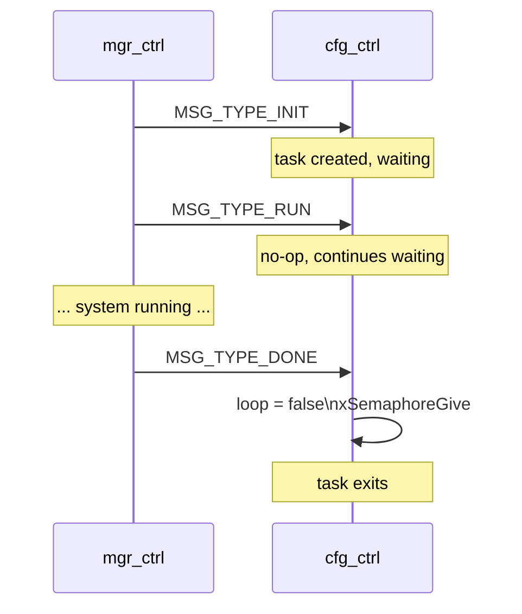

# Configuration Controller Module (`cfg_ctrl`)

Placeholder module for device-level configuration management. Currently implements the full standard module lifecycle (task, queue, semaphore) without application logic — ready for future extension.

---

## Overview

`cfg_ctrl` follows the standard Manager + Registry pattern exactly. It is intended to hold device-wide configuration operations (e.g. factory reset, config export/import, NVS management helpers) that do not belong to any specific peripheral module.

---

## File Structure

```
modules/cfg_ctrl/
├── CMakeLists.txt   — no extra dependencies
├── Kconfig.inc      — enable flag, log level
├── cfg_ctrl.c       — lifecycle (Init / Done / Run / Send), FreeRTOS task
└── include/
    └── cfg_ctrl.h   — public API (CfgCtrl_*)
```

---

## Current State

The task loop blocks on `xQueueReceive(portMAX_DELAY)` and handles only the three lifecycle messages:

| `msg.type` | Action |
|---|---|
| `MSG_TYPE_INIT` | Returns `ESP_TASK_INIT` (no-op) |
| `MSG_TYPE_RUN` | Returns `ESP_TASK_RUN` (no-op) |
| `MSG_TYPE_DONE` | Exits task loop, gives semaphore |
| Any other | Logs error, returns `ESP_FAIL` |

---

## Task Configuration

| Parameter | Value |
|---|---|
| Task name | `cfg-task` |
| Stack size | 4096 bytes |
| Priority | 12 |
| Queue depth | 8 messages |

---

## Module Lifecycle



---

## Kconfig Reference

Menu path: **Component config → CFG Controller**

| Option | Default | Description |
|---|---|---|
| `CFG_CTRL_ENABLE` | `n` | Enable the module |
| `CFG_CTRL_LOG_LEVEL` | INFO | Per-module log verbosity |

---

## Extending This Module

To add configuration operations:

1. Add a new `MSG_TYPE_CFG_*` variant in `include/msg.h`
2. Add a `case` branch in `cfgctrl_ParseMsg()`
3. Add NVS read/write helpers (use `nvs_ctrl.h` from `main/`)

---

## Related Documentation

- [ARCHITECTURE.md](ARCHITECTURE.md) — Manager + Registry pattern
- [TEMPLATE_CTRL.md](TEMPLATE_CTRL.md) — Reference implementation for new modules
