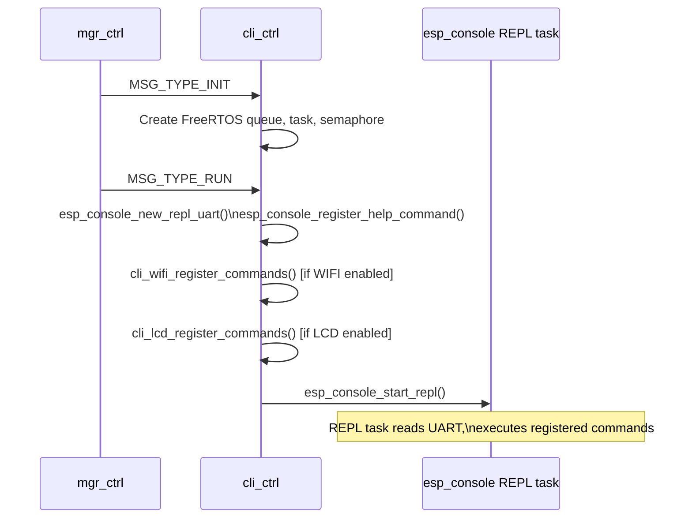
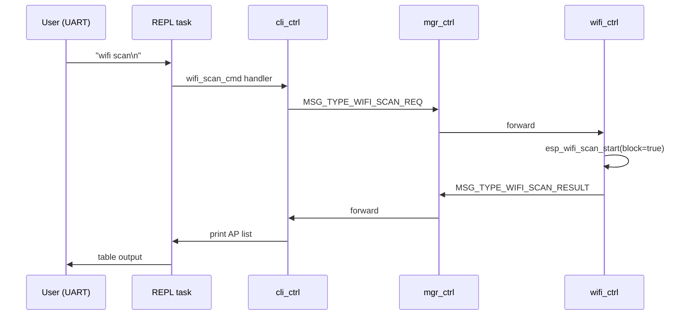

# CLI Controller Module (`cli_ctrl`)

Provides an interactive console REPL (Read-Eval-Print Loop) over UART/USB-CDC using the ESP-IDF `esp_console` component. Sub-commands for Wi-Fi and LCD are conditionally compiled when the corresponding modules are enabled.

---

## Overview

`cli_ctrl` starts the ESP-IDF console REPL and registers command handlers. Sub-command files follow the same guard pattern as modules:

| File | Guard | Commands registered |
|---|---|---|
| `cli_wifi.c` | `CONFIG_WIFI_CTRL_ENABLE` | `wifi scan`, `wifi connect <ssid> <pass>`, `wifi disconnect` |
| `cli_lcd.c` | `CONFIG_LCD_CTRL_ENABLE` | `lcd brightness <val>`, `lcd page <n>` |

Adding new sub-commands: create `cli_<module>.c`, register with `esp_console_cmd_register()`, include conditionally in `cli_ctrl.c`.

---

## File Structure

```
modules/cli_ctrl/
├── CMakeLists.txt   — conditional compile of cli_wifi.c and cli_lcd.c
├── Kconfig.inc      — REPL stack/priority, prompt string, log level
├── cli_ctrl.c       — lifecycle, REPL init, command registration hooks
├── cli_wifi.c       — Wi-Fi sub-commands (scan / connect / disconnect)
├── cli_lcd.c        — LCD sub-commands (brightness / page)
└── include/
    ├── cli_ctrl.h   — public API (CliCtrl_*)
    ├── cli_wifi.h   — cli_wifi_register_commands()
    └── cli_lcd.h    — cli_lcd_register_commands()
```

---

## REPL Startup Flow



---

## Wi-Fi Sub-Commands

### `wifi scan`

Sends `MSG_TYPE_WIFI_SCAN_REQ` to the manager, waits for `MSG_TYPE_WIFI_SCAN_RESULT`, prints SSID/RSSI table.

```
esp> wifi scan
Scanning...
 # SSID                        RSSI  Auth
 1 MyNetwork                    -52  WPA2
 2 Neighbor                     -78  WPA2
```

### `wifi connect <ssid> <password>`

Sends `MSG_TYPE_WIFI_CONNECT {ssid, password}`.

### `wifi disconnect`

Sends `MSG_TYPE_WIFI_DISCONNECT`.

---

## Message Flow (wifi scan example)



---

## Messages Consumed

`cli_ctrl`'s own task only processes the standard lifecycle messages (`INIT`, `RUN`, `DONE`). The REPL task runs independently and communicates with other modules by calling `MGR_Send()` directly from command handlers.

---

## Task Configuration

| Parameter | Value |
|---|---|
| Task name | `cli-task` |
| Stack size | 4096 bytes |
| Priority | 12 |
| Queue depth | 8 messages |
| REPL task stack | `CONFIG_CLI_CTRL_REPL_STACK_SIZE` (default 8192 bytes) |
| REPL task priority | `CONFIG_CLI_CTRL_REPL_TASK_PRIORITY` (default 2) |

---

## Kconfig Reference

Menu path: **Component config → CLI Controller**

| Option | Default | Description |
|---|---|---|
| `CLI_CTRL_ENABLE` | `n` | Enable the module |
| `CLI_CTRL_REPL_STACK_SIZE` | `8192` | REPL task stack (bytes) |
| `CLI_CTRL_REPL_TASK_PRIORITY` | `2` | REPL task FreeRTOS priority |
| `CLI_CTRL_PROMPT_STRING` | `"esp> "` | Console prompt |
| `CLI_CTRL_LOG_LEVEL` | INFO | Per-module log verbosity |

---

## Related Documentation

- [WIFI_CTRL.md](WIFI_CTRL.md) — Messages triggered by cli_wifi commands
- [LCD_CTRL.md](LCD_CTRL.md) — LCD commands available via cli_lcd
- [ARCHITECTURE.md](ARCHITECTURE.md) — How `MGR_Send()` is called from outside a task
