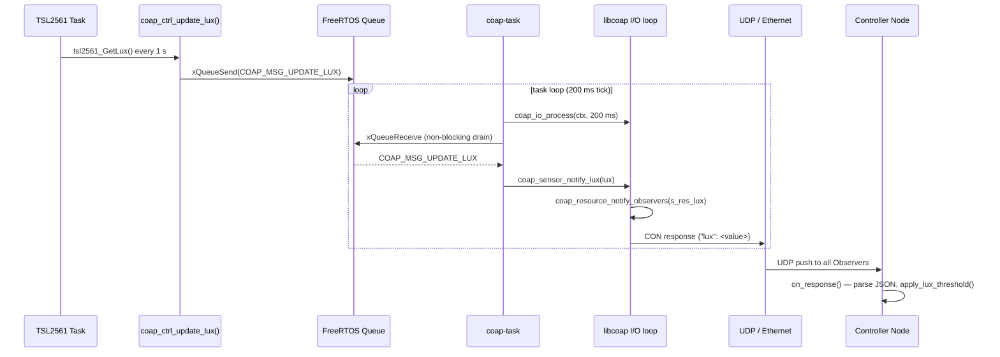
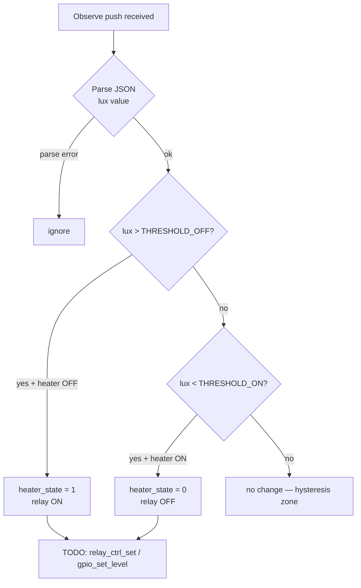
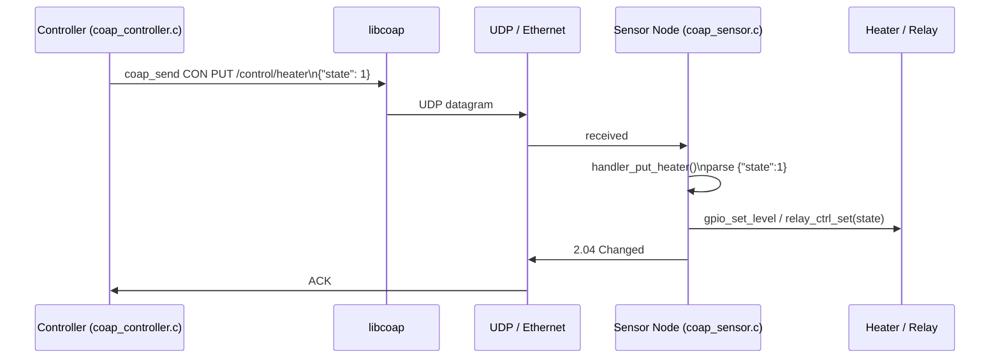
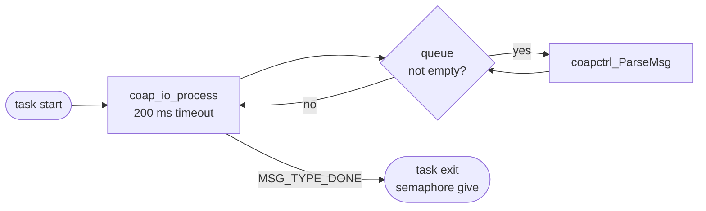
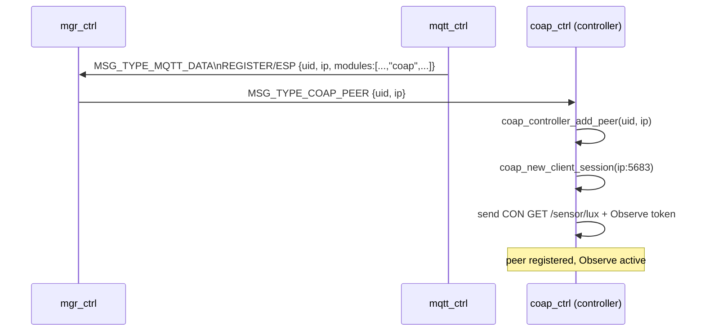

# CoAP Controller Module (`coap_ctrl`)

Direct peer-to-peer communication between **ESP32-EVB** (controller node) and **ESP32-S3-ETH** (sensor node) over CoAP/UDP — without an external MQTT broker.

---

## Overview

The `coap_ctrl` module is an alternative communication layer to MQTT. Both nodes run the same source tree; the role (sensor vs. controller) is selected at compile time via `idf.py menuconfig`. Communication happens directly over UDP port 5683 using the CoAP protocol (RFC 7252). The Observe extension (RFC 7641) replaces MQTT subscribe: the controller registers once and receives automatic push notifications on every sensor measurement.

```
┌─────────────────────────────────┐          ┌─────────────────────────────────┐
│      ESP32-S3-ETH               │          │      ESP32-EVB                  │
│      (Sensor Node)              │          │      (Controller Node)          │
│                                 │          │                                 │
│  CoAP SERVER                    │          │  CoAP SERVER                    │
│  ● GET /sensor/lux  (Observe)   │          │  ● GET /control/heater          │
│  ● GET /sensor/temp (Observe)   │          │  ● PUT /control/heater          │
│  ● PUT /control/heater          │          │  ● GET /control/pump            │
│  ● PUT /control/pump            │          │  ● PUT /control/pump            │
│                                 │          │  ● GET /status                  │
│  CoAP CLIENT                    │          │                                 │
│                                 │          │  CoAP CLIENT                    │
│                        UDP 5683 │◄────────►│ UDP 5683                        │
└─────────────────────────────────┘          └─────────────────────────────────┘
```

---

## Architecture

### Node Roles

The same source tree builds two different firmware images. The role is selected in `idf.py menuconfig` → **CoAP Controller → Node role**:

| Kconfig option | Target board | Compiled files |
|---|---|---|
| `COAP_CTRL_SENSOR_NODE` | ESP32-S3-ETH | `coap_ctrl.c` + `coap_sensor.c` |
| `COAP_CTRL_CONTROLLER_NODE` | ESP32-EVB | `coap_ctrl.c` + `coap_controller.c` |

### File Structure

```
modules/coap_ctrl/
├── CMakeLists.txt          — conditional compilation per node role
├── Kconfig.inc             — menuconfig options (role, port, lux thresholds)
├── coap_ctrl.c             — lifecycle (Init / Done / Run / Send) + FreeRTOS task
├── coap_sensor.c           — sensor node: CoAP server resources + notify helpers
├── coap_controller.c       — controller node: peer registry + Observe client
└── include/
    ├── coap_ctrl.h         — public API (CoapCtrl_*, coap_ctrl_update_lux)
    ├── coap_defs.h         — shared resource paths and constants
    ├── coap_sensor.h       — internal sensor node API
    └── coap_controller.h   — internal controller node API
```

### Platform Integration

`coap_ctrl` follows the standard platform module pattern — it registers in `mgr_reg_list[]` with its own `REG_COAP_CTRL` bit and exposes the four mandatory functions:

| Function | Description |
|---|---|
| `CoapCtrl_Init()` | Creates FreeRTOS queue, task, and semaphore; calls node-specific init |
| `CoapCtrl_Done()` | Sends `MSG_TYPE_DONE`, blocks until task exits |
| `CoapCtrl_Run()` | Posts `MSG_TYPE_RUN` to the task queue |
| `CoapCtrl_Send()` | Forwards `msg_t` from the manager to the task queue |
| `coap_ctrl_update_lux()` | Called by `sensor_ctrl` to push new lux readings (sensor node only) |

Four small additions to existing project files are required:

| File | Change |
|---|---|
| `include/msg.h` | `#define REG_COAP_CTRL (1 << 19)` |
| `include/mgr_reg_list.h` | Include `coap_ctrl.h` and add registry entry |
| `modules/Kconfig.inc` | `orsource "coap_ctrl/Kconfig.inc"` |
| `main/CMakeLists.txt` | `if(CONFIG_COAP_CTRL_ENABLE)` block |

---

## Data Flow

### Sensor Node → Controller: Observe Push

The sensor node acts as a CoAP server that exposes `/sensor/lux` as an Observable resource. The controller subscribes once at startup and receives automatic notifications on every new measurement.



### Controller: Threshold Logic



Default thresholds (configurable in menuconfig):

| Kconfig | Default | Meaning |
|---|---|---|
| `COAP_CTRL_LUX_THRESHOLD_OFF` | 500 lux | Turn heater ON when lux exceeds this value |
| `COAP_CTRL_LUX_THRESHOLD_ON` | 200 lux | Turn heater OFF when lux falls below this value |

The gap between the two thresholds creates hysteresis to prevent relay chatter.

### Controller → Sensor Node: PUT Command

The controller can send a PUT request to change the heater state on the sensor side.



---

## Task Architecture

`coap_ctrl` runs a single FreeRTOS task (`coap-task`, stack 8 KB, priority 9). The task loop alternates between driving the CoAP engine and draining the platform message queue:



The 200 ms I/O tick drives CoAP retransmissions, ACKs, and Observe heartbeats. Platform messages are processed with at most 200 ms latency, which is acceptable for sensor/control use cases.

---

## Peer Discovery (Controller Node)

Peers are discovered dynamically via the MQTT `REGISTER/ESP` mechanism — no static IP configuration is needed:



Up to 8 peers can be tracked simultaneously (`COAP_MAX_PEERS`). Each peer has its own `coap_session_t`, last lux reading, and heater state.

---

## CoAP Resources Summary

### Sensor Node (`COAP_CTRL_SENSOR_NODE`)

| Method | Resource | Observable | Payload | Description |
|---|---|---|---|---|
| `GET` | `/sensor/lux` | yes | `{"lux": <uint32>}` | Current ambient light intensity |
| `GET` | `/sensor/temp` | yes | `{"temp": 0}` | Temperature stub |
| `PUT` | `/control/heater` | — | `{"state": 0\|1}` | Set heater relay state |
| `PUT` | `/control/pump` | — | `{"state": 0\|1}` | Set pump relay state (stub) |

### Controller Node (`COAP_CTRL_CONTROLLER_NODE`)

| Method | Resource | Observable | Payload | Description |
|---|---|---|---|---|
| `GET` | `/control/heater` | — | `{"state": 0\|1}` | Read current heater state |
| `PUT` | `/control/heater` | — | `{"state": 0\|1}` | Set heater state |
| `GET` | `/control/pump` | — | `{"state": 0\|1}` | Read current pump state |
| `PUT` | `/control/pump` | — | `{"state": 0\|1}` | Set pump state |
| `GET` | `/status` | — | JSON object | All outputs summary |

---

## Kconfig Reference

Menu path: **Component config → CoAP Controller**

| Option | Type | Default | Description |
|---|---|---|---|
| `COAP_CTRL_ENABLE` | bool | `n` | Enable the module |
| `COAP_CTRL_NODE_ROLE` | choice | `SENSOR_NODE` | Sensor or controller role |
| `COAP_CTRL_PORT` | int | `5683` | UDP port (both server and client) |
| `COAP_CTRL_OBSERVE_INTERVAL_MS` | int | `5000` | Max Observe push interval (sensor node) |
| `COAP_CTRL_LUX_THRESHOLD_ON` | int | `200` | Lux level below which heater turns OFF |
| `COAP_CTRL_LUX_THRESHOLD_OFF` | int | `500` | Lux level above which heater turns ON |
| `COAP_CTRL_LOG_LEVEL` | choice | `INFO` | Per-module log verbosity |

---

## Comparison: CoAP vs MQTT

| Feature | MQTT (`mqtt_ctrl`) | CoAP (`coap_ctrl`) |
|---|---|---|
| Infrastructure | Requires external broker | Direct UDP, no broker |
| Subscribe | `mqtt_subscribe` topic | CoAP Observe (RFC 7641) |
| Reliability | TCP (QoS 0/1/2) | Confirmable UDP with retransmit |
| Latency | Broker round-trip | Direct peer-to-peer |
| Peer discovery | MQTT `REGISTER/ESP` topic | Also via MQTT `REGISTER/ESP` |
| Use case | Cloud/multi-device | Local LAN / off-grid |

Both transports can be enabled simultaneously — `coap_ctrl` and `mqtt_ctrl` are independent modules registered in the same manager registry.

---

## Related Documentation

- [ARCHITECTURE.md](ARCHITECTURE.md) — Manager + Registry pattern, `msg_t` routing
- [MQTT_CTRL.md](MQTT_CTRL.md) — MQTT topic structure used for peer discovery
- [BOARD.md](BOARD.md) — Hardware comparison (ESP32-EVB vs ESP32-S3-ETH)
- [docs/todo/COAP.md](todo/COAP.md) — Original design document
