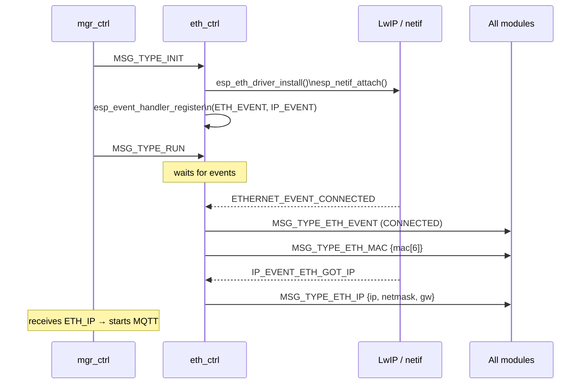
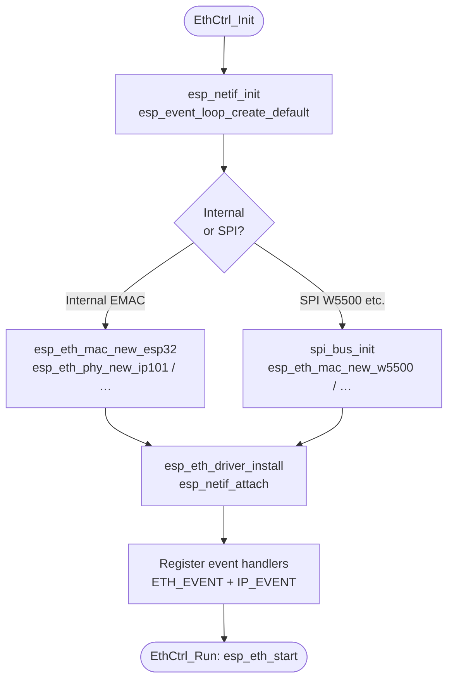

# Ethernet Controller Module (`eth_ctrl`)

Manages the Ethernet interface — initialises the MAC/PHY stack, registers event handlers, and broadcasts link-state and IP/MAC information to all other modules via the manager message bus.

**Registry position:** `eth_ctrl` must be the **first entry** in `mgr_reg_list[]` because all other modules depend on Ethernet being up before they start.

---

## Overview

`eth_ctrl` abstracts both supported Ethernet back-ends behind the same four-function module API:

| Back-end | Kconfig option | Typical board |
|---|---|---|
| Internal EMAC (RMII) | `ETH_CTRL_USE_INTERNAL_ETHERNET` | ESP32-EVB (IP101 PHY) |
| SPI Ethernet (W5500 / DM9051 / KSZ8851SNL) | `ETH_CTRL_USE_SPI_ETHERNET` | ESP32-S3-ETH (W5500) |

---

## File Structure

```
modules/eth_ctrl/
├── CMakeLists.txt   — conditional compile for internal/SPI back-end
├── Kconfig.inc      — PHY model, GPIO pins, SPI settings
├── eth_ctrl.c       — module lifecycle + ESP event handler
└── include/
    ├── eth_ctrl.h   — public API (EthCtrl_*)
    └── eth_lut.h    — GET_ETHERNET_EVENT_NAME() debug helper
```

---

## Message Flow

### Boot sequence



### Messages emitted

| `msg.type` | `msg.to` | Payload | Trigger |
|---|---|---|---|
| `MSG_TYPE_ETH_EVENT` | `REG_ALL_CTRL` | `event_id` (CONNECTED / DISCONNECTED / …) | Ethernet link change |
| `MSG_TYPE_ETH_MAC` | `REG_ALL_CTRL` | `mac[6]` — raw MAC bytes | After CONNECTED |
| `MSG_TYPE_ETH_IP` | `REG_ALL_CTRL` | `ip`, `netmask`, `gw` (LwIP `esp_netif_ip_info_t`) | `IP_EVENT_ETH_GOT_IP` |

### Messages consumed

`eth_ctrl` does not process any inbound messages beyond the standard lifecycle (`INIT`, `RUN`, `DONE`).

---

## Internal Architecture



---

## Kconfig Reference

Menu path: **Component config → ETH Controller**

| Option | Default | Description |
|---|---|---|
| `ETH_CTRL_ENABLE` | `y` | Enable the module |
| `ETH_CTRL_USE_INTERNAL_ETHERNET` | `y` (ESP32 only) | Use internal EMAC |
| `ETH_CTRL_PHY_MODEL` | `IP101` | PHY chip selection |
| `ETH_CTRL_MDC_GPIO` | 23 (ESP32) | SMI MDC GPIO |
| `ETH_CTRL_MDIO_GPIO` | 18 (ESP32) | SMI MDIO GPIO |
| `ETH_CTRL_PHY_RST_GPIO` | 5 (ESP32) | PHY hardware reset GPIO (-1 = disabled) |
| `ETH_CTRL_PHY_ADDR` | 1 | PHY address (−1 = auto-detect) |
| `ETH_CTRL_USE_SPI_ETHERNET` | `n` | Enable SPI Ethernet back-end |
| `ETH_CTRL_SPI_ETHERNETS_NUM` | 1 | Number of SPI Ethernet modules |
| `ETH_CTRL_ETHERNET_TYPE_SPI` | W5500 | SPI module type |
| `ETH_CTRL_SPI_CLOCK_MHZ` | 16 | SPI bus clock speed |
| `ETH_CTRL_LOG_LEVEL` | INFO | Per-module log verbosity |

---

## Related Documentation

- [ARCHITECTURE.md](ARCHITECTURE.md) — Manager + Registry pattern
- [BOARD.md](BOARD.md) — Board-specific Ethernet wiring and PHY details
- [MQTT_CTRL.md](MQTT_CTRL.md) — Started after `MSG_TYPE_ETH_IP` is received
