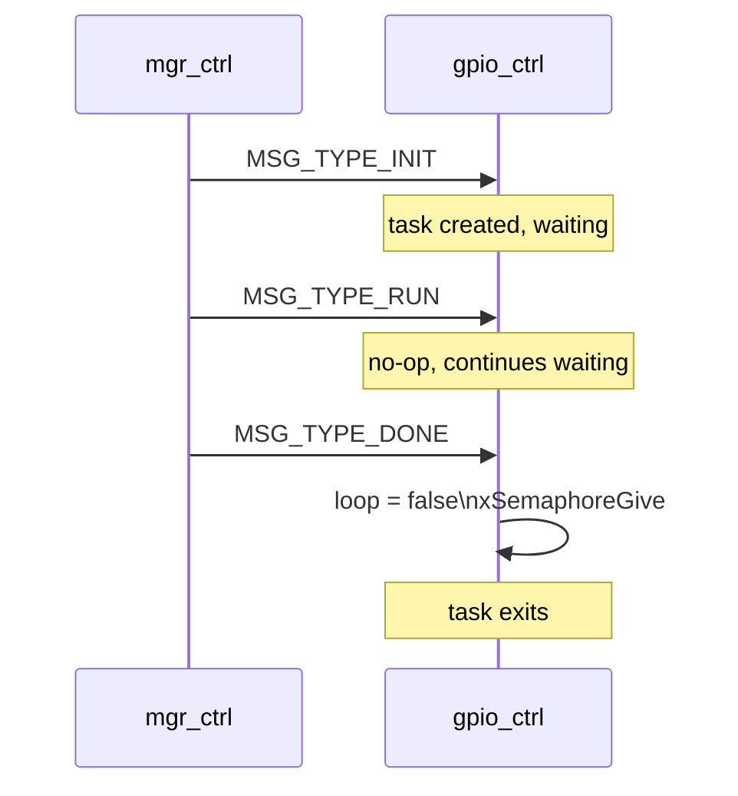

# GPIO Controller Module (`gpio_ctrl`)

Placeholder module for general-purpose GPIO management. Implements the full standard module lifecycle without application logic — intended for future expansion (interrupt-driven input monitoring, software debouncing, etc.).

---

## Overview

`gpio_ctrl` follows the standard Manager + Registry pattern. It is a stub that reserves the `REG_GPIO_CTRL` bit (`1 << 8`) and can be extended to manage GPIOs that do not belong to a specific peripheral (relay, LED, button, etc.).

---

## File Structure

```
modules/gpio_ctrl/
├── CMakeLists.txt   — no extra dependencies (driver included via esp-idf)
├── Kconfig.inc      — enable flag, log level
├── gpio_ctrl.c      — lifecycle (Init / Done / Run / Send), FreeRTOS task
└── include/
    └── gpio_ctrl.h  — public API (GpioCtrl_*)
```

---

## Current State

The task loop blocks on `xQueueReceive(portMAX_DELAY)` and handles only the three lifecycle messages. No GPIO pins are configured.

| `msg.type` | Action |
|---|---|
| `MSG_TYPE_INIT` | Returns `ESP_TASK_INIT` (no-op) |
| `MSG_TYPE_RUN` | Returns `ESP_TASK_RUN` (no-op) |
| `MSG_TYPE_DONE` | Exits task loop, gives semaphore |
| Any other | Logs error |

---

## Task Configuration

| Parameter | Value |
|---|---|
| Task name | `gpio-task` |
| Stack size | 4096 bytes |
| Priority | 12 |
| Queue depth | 4 messages |

---

## Module Lifecycle



---

## Kconfig Reference

Menu path: **Component config → GPIO Controller**

| Option | Default | Description |
|---|---|---|
| `GPIO_CTRL_ENABLE` | `n` | Enable the module |
| `GPIO_CTRL_LOG_LEVEL` | INFO | Per-module log verbosity |

---

## Extending This Module

To add GPIO pin management:

1. Add pin definitions and `gpio_config_t` setup to `GpioCtrl_Run()`
2. For interrupt-driven input: install GPIO ISR service, register per-pin handlers that post to `gpio_msg_queue`
3. Add new `MSG_TYPE_GPIO_*` variants in `include/msg.h` if cross-module events are needed

---

## Related Documentation

- [RELAY_CTRL.md](RELAY_CTRL.md) — Relay module which directly drives GPIO 32/33 independently
- [TEMPLATE_CTRL.md](TEMPLATE_CTRL.md) — Reference implementation for new modules
- [ARCHITECTURE.md](ARCHITECTURE.md) — Manager + Registry pattern
