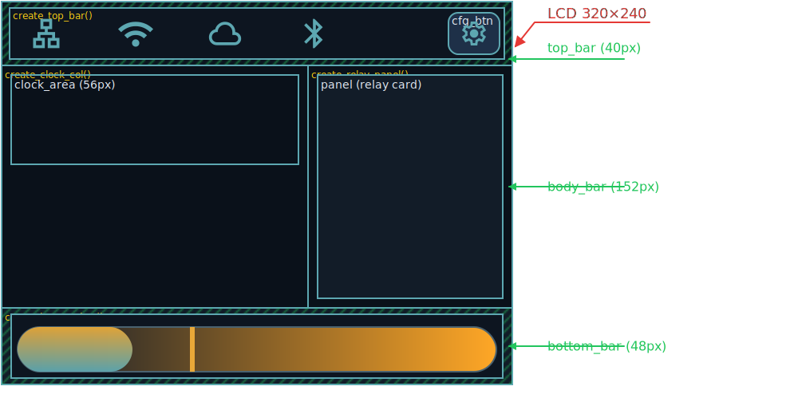

# LCD Module

## Overview

The `lcd_ctrl` module provides display and touch support for the ESP platform using:

- 2.8" LCD (`320x240`) with ILI9341 over SPI
- NS2009 touch panel over I2C
- LVGL 9.x as the GUI framework

The module is currently focused on **ESP32** and **ESP32-S3** targets (see `lcd_ctrl.c`); other SoCs fail the build guard.

Recent runtime changes worth knowing:

- LVGL display rotation is now handled in the **flush path** for partial-render mode, so non-zero `CONFIG_LCD_UI_ROTATION_*` settings affect the real panel output as expected.
- The touch input device is explicitly bound to the LVGL display, so LVGL rotates pointer coordinates internally.
- Status-bar icons now use fixed-size pressable slots, which makes resistive touch interaction more reliable than tapping raw labels.

## Current UI Status

### Main screen (`ui_main_screen`)



Fixed heights: `STATUS_BAR_H = 40`, `BOTTOM_BAR_H = 48`, `body_bar` = 152 px (flex grows to fill the remainder). `CLOCK_AREA_H = 56`.

#### Function hierarchy

`ui_main_screen_create()` delegates to three static functions; `create_body_bar()` further delegates:

```
ui_main_screen_create(display, on_ui_event)
├── create_top_bar(scr, on_ui_event)       — status bar strip (h = STATUS_BAR_H)
├── create_body_bar(scr, on_ui_event)      — flex-row body (h = 152 px)
│   ├── create_clock_col(body_bar)         — left 60%: digital clock + date
│   └── create_relay_panel(body_bar, on_ui_event)  — right 40%: relay panel card
└── create_bottom_bar(scr)                 — lux pill strip (h = BOTTOM_BAR_H)
```

#### Single-callback interaction model

All interactive widgets share a single `lv_event_cb_t on_ui_event` callback passed into `ui_main_screen_create()`. The source is encoded as `user_data` using the `ui_main_event_id_t` enum (see `ui_main_screen.h`):

```c
ui_main_event_id_t id = (ui_main_event_id_t)(uintptr_t)lv_event_get_user_data(e);
```

`lcd_ui_event_cb` in `lcd_helper.c` dispatches on `id` to open info dialogs or send relay commands.

#### Status bar (`create_top_bar`)

- Connectivity icons on the left: Ethernet (`MAT_ICON_LAN`), Wi-Fi (`MAT_ICON_WIFI`), MQTT (`MAT_ICON_CLOUD`), Bluetooth (`MAT_ICON_BLUETOOTH`)
- All four icons use **fixed-size pressable button slots** (`make_status_icon_slot`) for reliable resistive-touch targeting
- Ethernet, Wi-Fi, and MQTT icons are **clickable** (`LV_EVENT_PRESSED`, `LV_OBJ_FLAG_PRESS_LOCK`); each opens a matching info dialog (`ui_eth_info_dialog`, `ui_wifi_info_dialog`, `ui_mqtt_info_dialog`)
- Bluetooth icon is status-only (non-clickable)
- Settings (gear) button on the right → opens the **theme selector dialog** (`ui_theme_dialog`)

#### Body area (`create_body_bar`)

Left column (`create_clock_col`): digital clock `HH:MM.SS` (Montserrat 38 / fallback) + date label below.

Right column (`create_relay_panel`): rounded panel card with two relay sections (water heater, circulation pump) built by `add_relay_section()`. Each section has a title row, a “−” pill button, a center state pill, and a “+” pill button. Pill buttons use the shared `on_ui_event` callback with `UI_MAIN_EVENT_HEATER_OFF / _ON / PUMP_OFF / _ON` as user_data.

> **Note:** `create_relay_panel` is currently commented out in `create_body_bar` — the relay panel is not rendered. Re-enable when relay UX is finalized.

#### Ambient lux pill (`create_bottom_bar`)

`s_lux_track` is a plain `lv_obj` (not `lv_bar`) with a horizontal gradient background:

- **Gradient**: `COLOR_LUX_GRAD_L (#0A1628)` deep night blue → `COLOR_LUX_GRAD_R (#FFA726)` warm sunlight amber
- **Unlit zone**: `s_lux_gray_cover` — a floating `lv_obj` child covering from the current-lux marker to the right edge (`COLOR_LUX_UNLIT #121C28`). Updated in `layout_lux_markers()`.
- **Threshold marker**: `s_lux_thr_line` — red floating vertical line (`COLOR_LUX_THR_LINE #E53935`)
- **Value marker**: `s_lux_val_line` — white floating vertical line; marks the boundary between lit and unlit zones
- **Overlay** (`s_lux_overlay`): transparent flex row — `MAT_ICON_MOON` (left, dark/night side) | value + threshold labels (center, `flex_grow=1`) | `MAT_ICON_WB_SUNNY` (right, bright/day side)
- `clip_corner=true` on `s_lux_track` clips the gray cover's right corner to the pill radius automatically

`layout_lux_markers()` positions all three floating children (`s_lux_gray_cover`, `s_lux_thr_line`, `s_lux_val_line`) and resizes `s_lux_overlay` on every lux update.

#### Material Icons font

Font file: `fonts/lv_font_material_icons_22.c` (size 22 px, bpp 4).  
Regenerate with `fonts/gen_material_icons_font.sh` (requires Docker + `lv_font_conv`).

Current glyph set (11 glyphs):

| Define | Codepoint | Icon name |
|---|---|---|
| `MAT_ICON_LAN` | U+EB2F | lan |
| `MAT_ICON_WIFI` | U+E63E | wifi |
| `MAT_ICON_CLOUD` | U+E2BD | cloud |
| `MAT_ICON_BLUETOOTH` | U+E1A7 | bluetooth |
| `MAT_ICON_SETTINGS` | U+E8B8 | settings |
| `MAT_ICON_WB_SUNNY` | U+E430 | wb_sunny |
| `MAT_ICON_MOON` | U+F036 | mode_night |
| `MAT_ICON_WAVES` | U+E176 | waves |
| `MAT_ICON_SYNC` | U+E627 | sync |
| `MAT_ICON_PLAY` | U+E037 | play_arrow |
| `MAT_ICON_PAUSE` | U+E034 | pause |

#### Theme system

Background gradient is driven by `ui_theme_id_t` (defined in `ui_main_screen.h`). The active theme is stored as a session-only static; it survives screen switches but not reboots.

| ID | Name | Top color | Bottom color |
|---|---|---|---|
| `UI_THEME_DEEP_OCEAN` | Deep Ocean | `#1E4060` | `#0A1520` |
| `UI_THEME_NORDIC_HOME` | Nordic Home | `#1C3048` | `#0A111A` |
| `UI_THEME_WARM_SLATE` | Warm Slate | `#282038` | `#100C1E` |
| `UI_THEME_SUNRISE` | Sunrise | `#1E3828` | `#0A1510` |

API: `ui_main_screen_set_theme()`, `ui_main_screen_get_theme()`, `ui_main_screen_theme_info()`.

The **theme selector dialog** (`ui_theme_dialog.c`) opens from the settings button. Each row shows a gradient swatch, theme name, and a checkmark on the active theme. Selecting a row applies the gradient immediately. Closes on the “Close” button or when switching to the screensaver.

### Screensaver (`ui_screensaver`)

Implemented and active:

- On **cold boot** the active LVGL screen is the **screensaver** until the user completes a **stable touch** (then `lcd_switch_screen` opens the main UI).
- Analog clock (when `LV_USE_SCALE` is enabled), or digital fallback when disabled
- Date label
- Weather panel with icon, temperature, summary, and location
- Automatic return to the screensaver after idle timeout is **disabled** in code (`LCD_SCREENSAVER_IDLE_ENABLE` in `lcd_helper.c`); only the initial “wake from saver” path is active unless you re-enable it.

### Configuration / settings

- Mockup exists (`docs/todo/lcd_mockup_config.png`)
- `cfg_btn` (gear icon in the status bar) is wired and opens the **theme selector dialog** (`ui_theme_dialog`)
- A full multi-page configuration screen is not yet implemented

## Mockups (320x240)

Design reference files:

- `docs/todo/lcd_mockup_main.png`
- `docs/todo/lcd_mockup_config.png`
- `docs/todo/lcd_mockup_screensaver.png`

## Rotation and touch behavior

### Display rotation

`lv_display_set_rotation()` alone is not enough for this hardware when LVGL renders into partial draw buffers. The current implementation in `lcd_helper.c` now:

- checks `lv_display_get_rotation(display)` in the flush callback
- rotates the dirty rectangle with `lv_display_rotate_area()`
- rotates the RGB565 pixel data with `lv_draw_sw_rotate()`
- flushes the rotated area/buffer to `lcd_FlushDisplayArea()`

A scratch buffer (`s_rotated_buf`) is allocated only when the configured rotation is non-zero.

### Touch rotation and filtering

The NS2009 touch input is attached to the display with `lv_indev_set_display(s_touch_indev, s_display)`, which means LVGL applies the current display rotation during pointer processing. In other words: **do not manually “unrotate” touch coordinates in the read callback**.

The pressure filter still uses `CONFIG_LCD_NS2009_TOUCH_THRESHOLD`, but the effective runtime threshold is capped to **120** when `CONFIG_LCD_NS2009_REQUIRE_PRESSURE` is enabled. This prevents over-aggressive values from making valid taps disappear on resistive panels.

## Driver and Integration Layers

### `lcd_ctrl.c`

Controller-facing entry points and queue-based message handling. Handles `msg_t` types used for the status UI, including Ethernet and Wi-Fi link/IP events, MQTT events, and manager UID/MAC (see `lcdctrl_ParseMsg` in source).

### `lcd_helper.c`

LVGL integration layer:

- LVGL initialization
- display/touch binding
- software-assisted rotation in the flush callback when needed
- periodic LVGL tick and handler task
- UI update helpers used by LCD controller flow

### `lcd_hw.c`

Hardware composition layer for display + touch init/deinit.

### `ili9341v.c`

ILI9341 display backend:

- panel/bus setup via ESP-IDF `esp_lcd`
- LVGL flush callback integration
- DMA-capable frame buffer handling

### `ns2009.c`

Touch backend:

- I2C probe and reads
- coordinate conversion/calibration
- pressure / valid-touch filtering with a capped effective threshold

## Kconfig and Tuning Notes

Main LCD options are in `modules/lcd_ctrl/Kconfig.inc`, including:

- module enable/log levels
- touch calibration, axis swap/inversion, threshold options
- display orientation selection

Current checked-in ESP32 defaults enable:

- `CONFIG_LCD_CTRL_ENABLE=y`
- verbose LCD logging for helper / hardware / ILI9341 / NS2009 layers
- `CONFIG_LCD_NS2009_REQUIRE_PRESSURE=y`
- `CONFIG_LCD_NS2009_SWAP_XY=y`
- `CONFIG_LCD_NS2009_INVERT_X=y`
- `CONFIG_LCD_NS2009_INVERT_Y=y`

Font sizing for clock labels depends on enabled LVGL fonts in project config:

- e.g. `CONFIG_LV_FONT_MONTSERRAT_14`, `CONFIG_LV_FONT_MONTSERRAT_46`
- if a font is not enabled in config, related `lv_font_montserrat_*` symbol is not available

## Known Gaps / Next Work

- Implement dedicated configuration screen UI
- Re-enable and finalize the main screen relay panel
- Align docs/mockups with final runtime behavior as UI evolves
