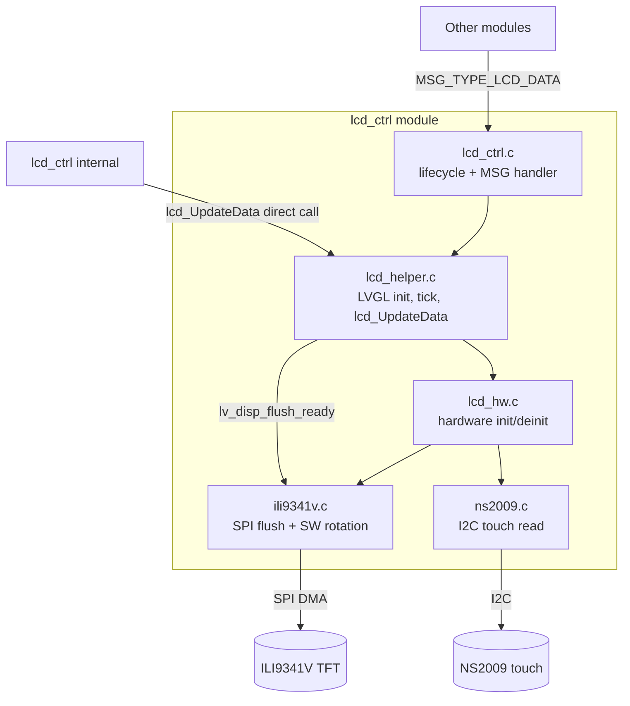
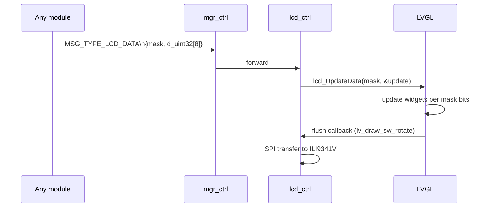

# LCD Controller Module (`lcd_ctrl`)

Drives a 2.8" ILI9341V 320×240 TFT display with NS2009 resistive touch over I2C/SPI. The UI is built with LVGL 9.x. Supported targets: **ESP32** and **ESP32-S3** only — a compile-time guard in `lcd_ctrl.c` enforces this.

---

## Overview

```
lcd_ctrl
├── lcd_hw.c       — hardware composition: display + touch init/deinit
├── ili9341v.c     — ILI9341 SPI driver, LVGL flush callback (with SW rotation)
├── ns2009.c       — NS2009 touch driver, I2C read, pressure filter, calibration
├── lcd_helper.c   — LVGL init, display/touch binding, tick task, lcd_UpdateData()
└── lcd_ctrl.c     — module entry points, MSG_TYPE_LCD_DATA handler
```

The UI lives in `ui/` and is written manually against the LVGL 9 API.

---

## File Structure

```
modules/lcd_ctrl/
├── CMakeLists.txt       — conditional build (ESP32 / ESP32-S3 only)
├── Kconfig.inc          — SPI/I2C pins, rotation, backlight, calibration
├── idf_component.yml    — managed component: lvgl__lvgl, espressif__esp_lcd_ili9341
├── fonts/               — Material Icons font (lv_font_material_icons_22.c)
├── ui/                  — LVGL screen definitions
├── lcd_ctrl.c           — lifecycle + MSG_TYPE_LCD_DATA handler
├── lcd_hw.c             — hardware init/deinit
├── ili9341v.c           — SPI flush callback
├── ns2009.c             — touch read callback
└── lcd_helper.c         — LVGL glue, lcd_UpdateData(), tick task
└── include/
    ├── lcd_helper.h     — lcd_UpdateData(), LCD_MASK_* constants
    └── (internal headers)
```

---

## Architecture



---

## Platform Integration

### Messages Consumed

| `msg.type` | Action |
|---|---|
| `MSG_TYPE_INIT` | Lifecycle: allocate task |
| `MSG_TYPE_RUN` | Init hardware (`lcd_hw_init`), init LVGL, start tick task, load UI |
| `MSG_TYPE_LCD_DATA` | Call `lcd_UpdateData(mask, &update)` |
| `MSG_TYPE_DONE` | Stop tick task, `lcd_hw_deinit`, semaphore give |

`lcd_ctrl` also handles Ethernet and Wi-Fi link/IP events and MQTT events directly to update status-bar icons (`lcdctrl_ParseMsg`).

### Display Update Paths

**Path 1 — Message bus** (from any module):



**Path 2 — Direct call** (within `lcd_ctrl` task context):

```c
lcd_update_t upd = { .mask = LCD_MASK_ETH, .d_uint32 = {1, ...} };
lcd_UpdateData(LCD_MASK_ETH, &upd);
```

### LCD Mask Bits

| Header | Constants | Purpose |
|---|---|---|
| `lcd_helper.h` | `LCD_MASK_BOARD`, `LCD_MASK_ETH`, `LCD_MASK_WIFI`, `LCD_MASK_MQTT`, `LCD_MASK_RELAY` | Internal to `lcd_ctrl` |
| `include/lcd_mask.h` | `LCD_MASK_AMBIENT_LUX`, `LCD_MASK_AMBIENT_THRESHOLD` | Used by external modules (sensor, relay) |

**Rule:** external modules include only `lcd_mask.h`; `lcd_helper.h` is `lcd_ctrl`-private.

### Task Configuration

| Parameter | Value |
|---|---|
| Task name | `lcd-task` |
| Stack size | per Kconfig (default 8192 bytes) |
| Priority | per Kconfig |
| LVGL tick interval | 5 ms |

---

## Rotation and Touch

### Display Rotation

`lv_display_set_rotation()` alone is insufficient for partial draw buffers. The flush callback in `lcd_helper.c`:

1. reads `lv_display_get_rotation(display)`
2. rotates the dirty rectangle with `lv_display_rotate_area()`
3. rotates pixel data with `lv_draw_sw_rotate()` into a scratch buffer (`s_rotated_buf`, allocated only when rotation ≠ 0)
4. flushes the rotated area/buffer to `lcd_FlushDisplayArea()`

### Touch Rotation and Filtering

The NS2009 input device is attached to the display with `lv_indev_set_display(s_touch_indev, s_display)` — LVGL applies display rotation to pointer coordinates automatically. **Do not manually unrotate touch coordinates in the NS2009 read callback.**

Pressure filter uses `CONFIG_LCD_NS2009_TOUCH_THRESHOLD`, capped to **120** at runtime when `CONFIG_LCD_NS2009_REQUIRE_PRESSURE=y` to prevent valid taps being rejected.

---

## UI Structure

### Main Screen (`ui_main_screen`)


Fixed heights: `STATUS_BAR_H = 40`, `BOTTOM_BAR_H = 48`, `body_bar = 152 px` (flex grows to fill remainder). `CLOCK_AREA_H = 56`.

#### Function Hierarchy

```
ui_main_screen_create(display, on_ui_event)
├── create_top_bar(scr, on_ui_event)       — status bar strip (h = STATUS_BAR_H)
├── create_body_bar(scr, on_ui_event)      — flex-row body (h = 152 px)
│   ├── create_analog_clock_col(body_bar)  — left square area: analog clock + date (default)
│   ├── create_clock_col(body_bar)         — digital clock alternative (fallback)
│   └── create_relay_panel(body_bar, on_ui_event)  — right 40%: relay panel (currently disabled)
└── create_bottom_bar(scr)                 — lux pill strip (h = BOTTOM_BAR_H)
```

#### Single-Callback Interaction Model

All interactive widgets share a single `lv_event_cb_t on_ui_event` passed into `ui_main_screen_create()`. Source is encoded as `user_data` using `ui_main_event_id_t`:

```c
ui_main_event_id_t id = (ui_main_event_id_t)(uintptr_t)lv_event_get_user_data(e);
```

`lcd_ui_event_cb` in `lcd_helper.c` dispatches on `id` to open info dialogs or send relay commands.

#### Status Bar (`create_top_bar`)

- Connectivity icons (left): Ethernet (`MAT_ICON_LAN`), Wi-Fi (`MAT_ICON_WIFI`), MQTT (`MAT_ICON_CLOUD`), Bluetooth (`MAT_ICON_BLUETOOTH`)
- All four use **fixed-size pressable button slots** (`make_status_icon_slot`) for reliable resistive-touch targeting
- ETH, Wi-Fi, MQTT icons are **clickable** — each opens a matching info dialog (`ui_eth_info_dialog`, `ui_wifi_info_dialog`, `ui_mqtt_info_dialog`)
- Bluetooth icon is status-only (non-clickable)
- Settings (gear) button (right) → opens **theme selector dialog** (`ui_theme_dialog`)

#### Body Area (`create_body_bar`)

- **Default path** (`create_analog_clock_col`): analog clock in a square area (`BODY_BAR_H × BODY_BAR_H`) with date label below
- **Fallback path** (`create_clock_col`): digital clock `HH:MM.SS` + date label
- **Right column** (`create_relay_panel`): rounded card with two relay sections (water heater, circulation pump); each section has title row, `−` pill, center state pill, `+` pill. Currently **commented out** — re-enable when relay UX is finalized.

#### Ambient Lux Pill (`create_bottom_bar`)

`s_lux_track` is a plain `lv_obj` (not `lv_bar`) with horizontal gradient background:

- **Gradient**: `COLOR_LUX_GRAD_L (#0A1628)` deep night blue → `COLOR_LUX_GRAD_R (#FFA726)` warm amber
- **Unlit zone**: `s_lux_gray_cover` — floating child covering lux marker to right edge (`COLOR_LUX_UNLIT #121C28`)
- **Threshold marker**: `s_lux_thr_line` — red vertical line (`COLOR_LUX_THR_LINE #E53935`)
- **Value marker**: `s_lux_val_line` — white vertical line marking lit/unlit boundary
- **Overlay**: transparent flex row — `MAT_ICON_MOON` (left) | value + threshold labels (center, `flex_grow=1`) | `MAT_ICON_WB_SUNNY` (right)
- `clip_corner=true` on `s_lux_track` clips the gray cover's right corner to the pill radius

`layout_lux_markers()` positions all three floating children and resizes the overlay on every lux update.

### Screensaver (`ui_screensaver`)

- On **cold boot** the active LVGL screen is the **screensaver** until a **stable touch** switches to the main UI (`lcd_switch_screen`)
- Analog clock (when `LV_USE_SCALE` enabled) or digital fallback
- Date label, weather panel with icon / temperature / summary / location
- Auto-return to screensaver after idle timeout is **disabled** in code (`LCD_SCREENSAVER_IDLE_ENABLE` in `lcd_helper.c`); only the initial wake path is active

### Theme System

Background gradient driven by `ui_theme_id_t` (defined in `ui_main_screen.h`). Stored as session-only static — survives screen switches, not reboots.

| ID | Name | Top color | Bottom color |
|---|---|---|---|
| `UI_THEME_DEEP_OCEAN` | Deep Ocean | `#1E4060` | `#0A1520` |
| `UI_THEME_NORDIC_HOME` | Nordic Home | `#1C3048` | `#0A111A` |
| `UI_THEME_WARM_SLATE` | Warm Slate | `#282038` | `#100C1E` |
| `UI_THEME_SUNRISE` | Sunrise | `#1E3828` | `#0A1510` |

API: `ui_main_screen_set_theme()`, `ui_main_screen_get_theme()`, `ui_main_screen_theme_info()`.

**Theme selector dialog** (`ui_theme_dialog.c`): opens from settings button, shows gradient swatch + name + checkmark for active theme. Selecting applies gradient immediately.

### Mockups (320×240)

Design reference files in `docs/todo/`:
- `lcd_mockup_main.png`
- `lcd_mockup_config.png`
- `lcd_mockup_screensaver.png`

---

## Driver Layers

### `lcd_ctrl.c`

Entry points: `LcdCtrl_Init`, `LcdCtrl_Done`, `LcdCtrl_Run`, `LcdCtrl_Send`. Handles `msg_t` types for status UI including ETH/Wi-Fi link events, MQTT events, manager UID/MAC (`lcdctrl_ParseMsg`).

### `lcd_helper.c`

LVGL integration: initialization, display/touch binding, software-assisted rotation in the flush callback, periodic LVGL tick and handler task, `lcd_UpdateData()`.

### `lcd_hw.c`

Hardware composition for display + touch init/deinit. Input validation added in `lcd_InitHw` (`lcd_ptr != NULL`). If `ns2009_Init` fails after display init, the display layer is rolled back (`lcd_DoneDisplayHw`) before returning the error.

### `ili9341v.c`

ILI9341 display backend: panel/bus setup via ESP-IDF `esp_lcd`, LVGL flush callback, DMA-capable frame buffer.

### `ns2009.c`

Touch backend: I2C probe and reads, coordinate conversion/calibration, pressure filtering. Probe-failure cleanup removes the added I2C device handle and deletes the owned bus to avoid leaked handles.

---

## Fonts

Font file: `fonts/lv_font_material_icons_22.c` (size 22 px, bpp 4).

Regenerate:

```bash
cd modules/lcd_ctrl/fonts
./gen_material_icons_font.sh   # requires Docker + lv_font_conv
```

Current glyph set (11 glyphs):

| Define | Codepoint | Icon name |
|---|---|---|
| `MAT_ICON_LAN` | U+EB2F | lan |
| `MAT_ICON_WIFI` | U+E63E | wifi |
| `MAT_ICON_CLOUD` | U+E2BD | cloud |
| `MAT_ICON_BLUETOOTH` | U+E1A7 | bluetooth |
| `MAT_ICON_SETTINGS` | U+E8B8 | settings |
| `MAT_ICON_WB_SUNNY` | U+E430 | wb_sunny |
| `MAT_ICON_MOON` | U+F036 | mode_night |
| `MAT_ICON_WAVES` | U+E176 | waves |
| `MAT_ICON_SYNC` | U+E627 | sync |
| `MAT_ICON_PLAY` | U+E037 | play_arrow |
| `MAT_ICON_PAUSE` | U+E034 | pause |

Font sizing for clock labels depends on enabled LVGL fonts in project config (e.g. `CONFIG_LV_FONT_MONTSERRAT_14`, `CONFIG_LV_FONT_MONTSERRAT_46`).

---

## Kconfig Reference

Menu path: **Component config → LCD Controller** (`modules/lcd_ctrl/Kconfig.inc`)

| Option | Default (ESP32) | Description |
|---|---|---|
| `LCD_CTRL_ENABLE` | `y` | Enable the module |
| `LCD_CTRL_ROTATION` | 0 | Display rotation: 0 / 90 / 180 / 270 degrees |
| `LCD_CTRL_BACKLIGHT_GPIO` | — | Backlight PWM GPIO |
| `LCD_NS2009_REQUIRE_PRESSURE` | `y` | Reject touches with insufficient pressure |
| `LCD_NS2009_TOUCH_THRESHOLD` | — | Raw pressure threshold (capped to 120 at runtime) |
| `LCD_NS2009_SWAP_XY` | `y` | Swap X/Y axes for portrait/landscape correction |
| `LCD_NS2009_INVERT_X` | `y` | Invert X axis |
| `LCD_NS2009_INVERT_Y` | `y` | Invert Y axis |
| `LCD_CTRL_LOG_LEVEL` | VERBOSE | Per-layer log verbosity (helper / hw / ILI9341 / NS2009) |

---

## Known Gaps / Next Work

- Implement dedicated configuration screen UI
- Re-enable and finalize the main screen relay panel
- Align docs/mockups with final runtime behavior as UI evolves

---

## Related Documentation

- [ARCHITECTURE.md](ARCHITECTURE.md) — `MSG_TYPE_LCD_DATA` routing
- [BOARD.md](BOARD.md) — Supported boards (ESP32, ESP32-S3 only for LCD)
- [CLI_CTRL.md](CLI_CTRL.md) — `cli_lcd` sub-commands
