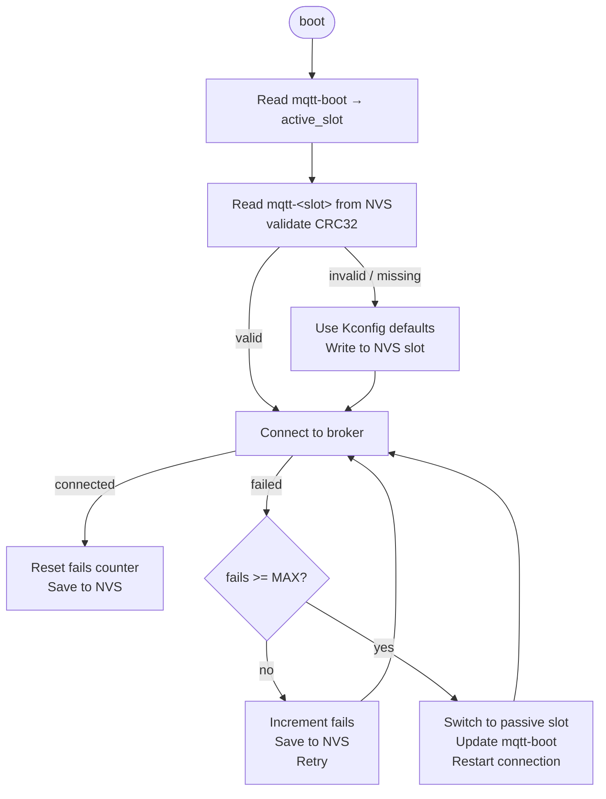
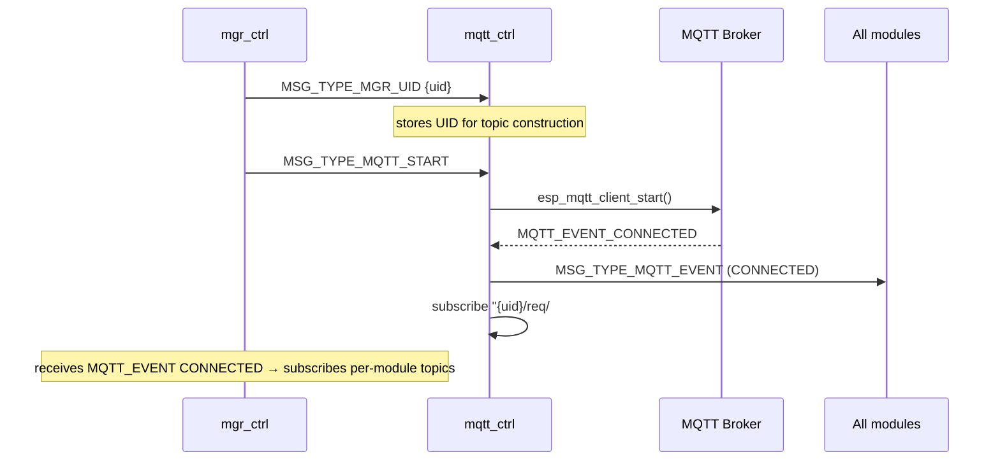
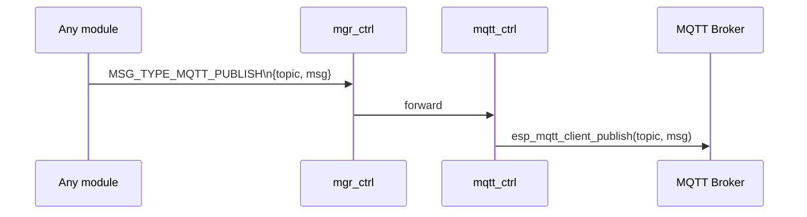
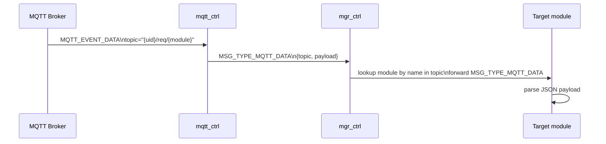

# MQTT Controller Module (`mqtt_ctrl`)

Bridge between the platform's internal message bus and an external MQTT broker. It forwards outbound `MSG_TYPE_MQTT_PUBLISH` messages to the broker, routes inbound MQTT payloads to the matching module by topic, and manages broker configuration with NVS redundancy.

**Registry position:** `mqtt_ctrl` must be the **last entry** in `mgr_reg_list[]`.

---

## Overview

```
Other modules                mqtt_ctrl                 MQTT Broker
─────────────     ───────────────────────────────     ─────────────
MSG_TYPE_MQTT_PUBLISH  ──►  esp_mqtt_client_publish  ──►  broker
MSG_TYPE_MQTT_SUBSCRIBE ──►  esp_mqtt_client_subscribe
                         ◄──  MQTT_EVENT_DATA         ◄──  broker
                             parse topic → module name
                             MGR_Send MSG_TYPE_MQTT_DATA ──► module
```

---

## File Structure

```
modules/mqtt_ctrl/
├── CMakeLists.txt   — depends on esp_mqtt
├── Kconfig.inc      — broker URL/port/credentials, NVS reset flag
├── mqtt_ctrl.c      — lifecycle, event handler, NVS config management
└── include/
    ├── mqtt_ctrl.h  — public API (MqttCtrl_*)
    └── mqtt_lut.h   — GET_MQTT_EVENT_NAME() debug helper
```

---
\
## NVS Configuration (Redundant Slots)

Broker credentials are stored in the NVS partition `"config"` with two redundant slots plus a boot-selector key:

```
NVS partition: "config"
├── "mqtt-boot"  → uint8_t  (1 = use slot 1, 2 = use slot 2)
├── "mqtt-1"     → mqtt_config_t  (URI, port, user, password, fail_count, CRC32)
└── "mqtt-2"     → mqtt_config_t  (passive / backup slot)
```

A CRC32 field validates each slot. On connection failure the module increments the `fails` counter; after `MQTT_NVS_FAILS_MAX` failures it falls back to the passive slot. When `CONFIG_MQTT_CTRL_RESET_CONFIG_ON_BOOT=y` both slots are erased and recreated from Kconfig defaults on every boot.



---

## Message Flow

### Startup



### Publish (outbound)



### Inbound data routing



---

## Messages Consumed

| `msg.type` | Source | Action |
|---|---|---|
| `MSG_TYPE_MGR_UID` | manager | Store UID for topic construction |
| `MSG_TYPE_MQTT_START` | manager (on ETH_IP) | Start `esp_mqtt_client` |
| `MSG_TYPE_MQTT_STOP` | manager | Stop `esp_mqtt_client` |
| `MSG_TYPE_MQTT_PUBLISH` | any module | Forward payload to broker |
| `MSG_TYPE_MQTT_SUBSCRIBE` | any module | Subscribe to a single topic |
| `MSG_TYPE_MQTT_SUBSCRIBE_LIST` | any module | Subscribe to a list of topics |
| `MSG_TYPE_MQTT_EVENT` | self (from event handler) | Broadcast CONNECTED/DISCONNECTED |
| `MSG_TYPE_MQTT_DATA` | self (from event handler) | Route inbound payload to module |

---

## MQTT Topic Convention

```
{uid}/req/{module}   — inbound commands (subscribed by the device)
{uid}/event/{module} — outbound events (published by the device)
{uid}/res/{module}   — outbound responses
```

Where `{uid}` = `ESP/XXXXXX` (last 3 bytes of Ethernet MAC, e.g. `ESP/12AB34`).

---

## Task Configuration

| Parameter | Value |
|---|---|
| Task name | `mqtt-task` |
| Stack size | 4096 bytes |
| Priority | 9 |
| Queue depth | 8 messages |

---

## Kconfig Reference

Menu path: **Component config → MQTT Controller**

| Option | Default | Description |
|---|---|---|
| `MQTT_CTRL_ENABLE` | `y` | Enable the module |
| `MQTT_CTRL_BROKER_URL` | `mqtt://homeassistant.local:1883` | Default broker URL |
| `MQTT_CTRL_BROKER_PORT` | `1883` | Default broker port |
| `MQTT_CTRL_CREDENTIAL_USERNAME` | `""` | MQTT username |
| `MQTT_CTRL_CREDENTIAL_PASSWORD` | `""` | MQTT password |
| `MQTT_CTRL_RESET_CONFIG_ON_BOOT` | `n` | Erase NVS config on every boot |
| `MQTT_CTRL_LOG_LEVEL` | INFO | Per-module log verbosity |

---

## Related Documentation

- [ARCHITECTURE.md](ARCHITECTURE.md) — Manager routing and `send_fn` dispatch
- [ETH_CTRL.md](ETH_CTRL.md) — Ethernet link-up triggers `MSG_TYPE_MQTT_START`

---

## MQTT Protocol Reference

Bidirectional communication between the device and external clients via the MQTT broker. All payloads are JSON. The most important field is **`operation`**:

| Value | Meaning |
|---|---|
| `event` | Unsolicited data notification |
| `set` | Write request |
| `get` | Read request |
| `response` | Reply to `set`/`get` |

More information: [mqtt.org](https://mqtt.org/)

### Topic Index

- [REGISTER/ESP](#registeresp)
- [MQTT Module](#mqtt-module-1)
- [RELAY Module](#relay-module)
- [SENSOR Module](#sensor-module)
- [SYSTEM Module](#system-module)

---

### REGISTER/ESP

Information about connected devices. On startup the device publishes its configuration and subscribes to its topic list.

**Topic:** `REGISTER/ESP`

**Get current controller configuration:**
```json
{ "operation": "get" }
```

**Response / Event:**
```json
{
  "operation": "response",
  "uid": "ESP/12AB34",
  "mac": "12:34:56:78:90:AB",
  "ip": "10.0.0.20",
  "list": ["eth", "wifi", "relay", "lcd", "sys", "sensor", "cli", "mqtt"]
}
```

---

### MQTT Module

Configuration of MQTT broker connection.

**Topics:** `ESP/12AB34/req/mqtt` (request), `ESP/12AB34/res/mqtt` (response)

**Set broker configuration:**
```json
{
  "operation": "set",
  "broker": {
    "address": {
      "uri": "mqtt://broker.example.com",
      "port": 1883
    },
    "username": "user",
    "password": "pass"
  }
}
```

**Get current state:**
```json
{ "operation": "get" }
```

**Response after get:**
```json
{
  "operation": "response",
  "broker": {
    "address": {
      "uri": "mqtt://broker.example.com",
      "port": 1883
    }
  }
}
```

---

### RELAY Module

Control of relay switches.

**Topics:** `ESP/12AB34/req/relay` (request), `ESP/12AB34/res/relay` (response and event)

**Set relay state:**
```json
{
  "operation": "set",
  "relays": [
    { "number": 0, "state": "on" },
    { "number": 1, "state": "off" }
  ]
}
```

**Get current state:**
```json
{ "operation": "get" }
```

**Response / Event** (both published on `ESP/12AB34/res/relay`):
```json
{
  "operation": "response",
  "relays": [
    { "number": 0, "state": "on" },
    { "number": 1, "state": "off" }
  ]
}
```

For successful `set`, the payload uses `"operation": "event"` with the same `relays` structure.

---

### SENSOR Module

Configuration and monitoring of sensors.

**Topics:** `ESP/12AB34/req/sensor` (request), `ESP/12AB34/res/sensor` (response), `ESP/12AB34/event/sensor` (event)

**Set sensor configuration:**
```json
{
  "operation": "set",
  "sensor": "name-of-sensor",
  "data": [
    { "type": "threshold", "threshold": 100 },
    { "type": "lux", "lux": 5000 }
  ]
}
```

**Get sensor parameters:**
```json
{
  "operation": "get",
  "sensor": "name-of-sensor",
  "data": ["info", "threshold", "lux"]
}
```

**Response:**
```json
{
  "operation": "response",
  "sensor": "name-of-sensor",
  "data": [
    { "type": "threshold", "threshold": 100 },
    { "type": "lux", "lux": 5000 },
    { "type": "info", "info": {} }
  ]
}
```

**Event:**
```json
{
  "operation": "event",
  "sensor": "name-of-sensor",
  "data": [
    { "type": "threshold", "threshold": 100 },
    { "type": "lux", "lux": 5000 }
  ]
}
```

---

### SYSTEM Module

Time synchronization (NTP) and timezone configuration.

**Topics:** `ESP/12AB34/req/sys` (request), `ESP/12AB34/res/sys` (response), `ESP/12AB34/event/sys` (event)

**Set timezone / NTP servers / time (all fields optional):**
```json
{
  "operation": "set",
  "timezone": "CST6CDT,M3.2.0/2,M11.1.0/2",
  "time": 1738512000,
  "ntp": {
    "servers": ["pool.ntp.org", "time.google.com", "time.cloudflare.com"]
  }
}
```

**Timezone** follows POSIX TZ string format:

| TZ string | Zone |
|---|---|
| `CET-1CEST,M3.5.0,M10.5.0/3` | Central European Time |
| `EST5EDT,M3.2.0,M11.1.0` | Eastern Time (US) |
| `PST8PDT,M3.2.0,M11.1.0` | Pacific Time (US) |
| `CST6CDT,M3.2.0/2,M11.1.0/2` | Central Time (US) |
| `UTC0` | UTC |

**Get current state:**
```json
{
  "operation": "get",
  "fields": ["timezone", "time", "ntp"]
}
```

**Response status semantics:**

| `status` | Meaning |
|---|---|
| `"ok"` | All requested fields processed successfully |
| `"partial"` | At least one field applied, at least one failed |
| `"error"` | No field applied successfully |

**Response (success):**
```json
{
  "operation": "response",
  "status": "ok",
  "timezone": "CST6CDT,M3.2.0/2,M11.1.0/2",
  "time": 1738512000,
  "ntp": {
    "servers": ["pool.ntp.org", "time.google.com", "time.cloudflare.com"],
    "synced": true
  }
}
```

**Response (partial failure):**
```json
{
  "operation": "response",
  "status": "partial",
  "error": { "code": 258, "message": "Invalid 'time' field type" },
  "timezone": "CST6CDT,M3.2.0/2,M11.1.0/2"
}
```

**Response (full failure):**
```json
{
  "operation": "response",
  "status": "error",
  "error": { "code": 258, "message": "Failed to apply NTP settings" }
}
```

**Event** — published after fully or partially successful `set`; not published for `status: "error"`:
```json
{
  "operation": "event",
  "status": "ok",
  "timezone": "CST6CDT,M3.2.0/2,M11.1.0/2",
  "time": 1738512000,
  "ntp": {
    "servers": ["pool.ntp.org", "time.google.com", "time.cloudflare.com"],
    "synced": true
  }
}
```
