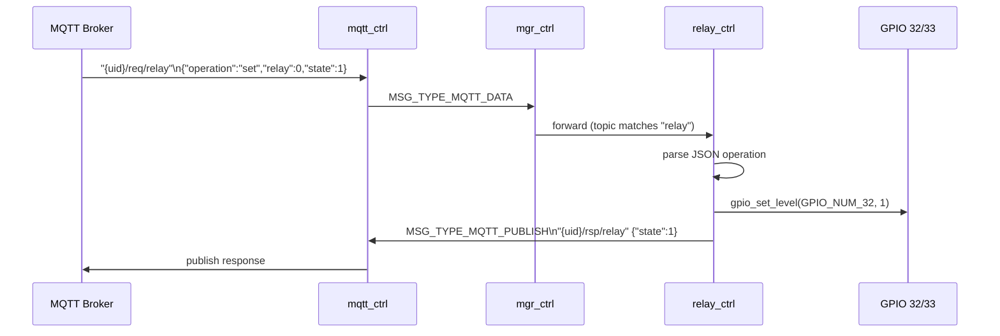

# Relay Controller Module (`relay_ctrl`)

Controls two GPIO-connected relays. Receives set/get commands via MQTT and updates GPIO output levels accordingly.

---

## Overview

`relay_ctrl` manages a fixed two-slot relay array mapped to GPIO 32 and GPIO 33 (ESP32-EVB relay outputs). Each slot tracks its current state. Commands arrive as JSON payloads over MQTT; responses are published back to the broker.

```
MQTT broker
  "{uid}/req/relay"  →  relay_ctrl  →  gpio_set_level(GPIO_NUM_32 / GPIO_NUM_33)
  "{uid}/rsp/relay"  ←  relay_ctrl  ←  read current state
```

---

## File Structure

```
modules/relay_ctrl/
├── CMakeLists.txt   — depends on driver (GPIO)
├── Kconfig.inc      — log level
├── relay_ctrl.c     — lifecycle, GPIO config, MQTT command handling
└── include/
    └── relay_ctrl.h — public API (RelayCtrl_*)
```

---

## Relay Slot Table

```c
relay_t relay_slots[] = {
  { .gpio = GPIO_NUM_32, .level = 0 },   // relay 0
  { .gpio = GPIO_NUM_33, .level = 0 },   // relay 1
};
```

Both GPIOs are configured as `GPIO_MODE_INPUT_OUTPUT` (readable-back output) without pull-up/pull-down.

---

## MQTT Command Handling

### Set relay state

Topic: `{uid}/req/relay`

```json
{ "operation": "set", "relay": 0, "state": 1 }
```

- `relay` — slot index (0 or 1)
- `state` — `0` = OFF, `1` = ON

### Get relay state

Topic: `{uid}/req/relay`

```json
{ "operation": "get", "relay": 0 }
```

Response published to `{uid}/rsp/relay`:

```json
{ "operation": "rsp", "relay": 0, "state": 1 }
```

---

## Message Flow



---

## Messages Consumed

| `msg.type` | Action |
|---|---|
| `MSG_TYPE_INIT` | Lifecycle: allocate task |
| `MSG_TYPE_RUN` | Lifecycle: configure GPIOs via `relayctrl_Configure()` |
| `MSG_TYPE_MGR_UID` | Store device UID for response topic construction |
| `MSG_TYPE_MQTT_EVENT` | React to CONNECTED (optional, currently logged only) |
| `MSG_TYPE_MQTT_DATA` | Parse JSON command: `set` or `get` |

---

## State Flow

```mermaid
flowchart TD
    A[MSG_TYPE_MQTT_DATA] --> B{operation?}
    B -->|set| C{relay 0..1?}
    C -->|valid| D[relayctrl_SetRelayState\ngpio_set_level]
    D --> E[Publish rsp/relay {state}]
    C -->|invalid| F[Log error]
    B -->|get| G{relay 0..1?}
    G -->|valid| H[relayctrl_GetRelayState\ngpio_get_level]
    H --> I[Publish rsp/relay {state}]
    G -->|invalid| F
```

---

## Task Configuration

| Parameter | Value |
|---|---|
| Task name | `relay-task` |
| Stack size | 4096 bytes |
| Priority | 12 |
| Queue depth | 4 messages |

---

## Kconfig Reference

Menu path: **Component config → RELAY Controller**

| Option | Default | Description |
|---|---|---|
| `RELAY_CTRL_ENABLE` | `y` | Enable the module |
| `RELAY_CTRL_LOG_LEVEL` | INFO | Per-module log verbosity |

---

## Related Documentation

- [MQTT_CTRL.md](MQTT_CTRL.md) — Full topic and payload conventions
- [BOARD.md](BOARD.md) — GPIO 32/33 relay wiring on ESP32-EVB
- [SENSOR_CTRL.md](SENSOR_CTRL.md) — Lux sensor data that drives relay decisions
