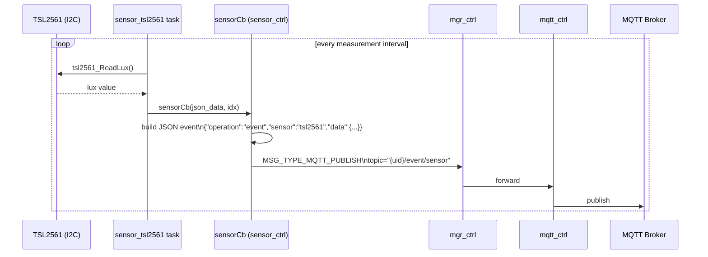
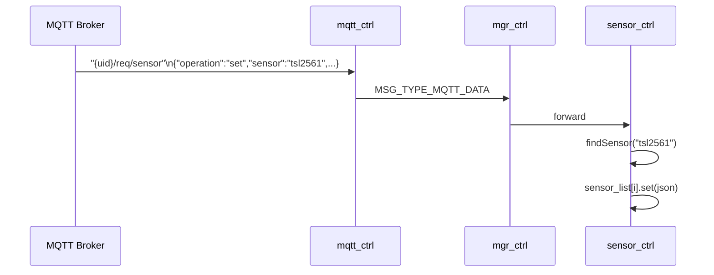

# Sensor Controller Module (`sensor_ctrl`)

Manages a registry of physical sensors. Currently supports the **TSL2561** I2C ambient-light sensor. Each sensor runs its own FreeRTOS task; readings are published to the MQTT broker as JSON events.

---

## Overview

`sensor_ctrl` uses a sub-registry pattern (`sensor_list[]`) mirroring the top-level `mgr_reg_list[]`. Each entry in the list holds `init`, `done`, `run`, `set`, and `get` function pointers for one sensor type. The controller iterates the list on startup, starts all sensor tasks, and provides a shared callback (`sensorCb`) that publishes readings to MQTT.

```
TSL2561 I2C sensor
  └─ sensor_tsl2561 task  ──[sensorCb]──►  sensor_ctrl
                                              └─ MSG_TYPE_MQTT_PUBLISH → mqtt_ctrl → broker
                                                 topic: "{uid}/event/sensor"
                                                 payload: {"operation":"event","sensor":"tsl2561","data":{...}}
```

---

## File Structure

```
modules/sensor_ctrl/
├── CMakeLists.txt       — links drivers/tsl2561, depends on sensor_tsl2561
├── Kconfig.inc          — enable sensor_ctrl, enable TSL2561, log levels
├── sensor_ctrl.c        — lifecycle, sensor sub-registry init/done/run
├── sensor_tsl2561.c     — TSL2561 I2C driver wrapper + FreeRTOS task
└── include/
    ├── sensor_ctrl.h    — public API (SensorCtrl_*)
    ├── sensor_data.h    — sensor_data_t union (lux, temp, raw)
    ├── sensor_list.h    — sensor_list[] static registry
    ├── sensor_reg.h     — sensor_reg_t struct (name, type, fn pointers)
    └── sensor_lut.h     — debug name helpers
```

---

## Sensor Registry

```c
// include/sensor_list.h
static sensor_reg_t sensor_list[] = {
#ifdef CONFIG_SENSOR_TSL2561_ENABLE
  { "tsl2561", SENSOR_TYPE_TSL2561,
    sensor_InitTsl2561, sensor_DoneTsl2561, sensor_RunTsl2561,
    sensor_SetTsl2561,  sensor_GetTsl2561 },
#endif
};
```

Adding a new sensor: implement the five functions, add a `sensor_reg_t` entry here, and add its Kconfig guard.

---

## Data Flow

### Sensor reading → MQTT publish



### MQTT command → sensor configuration



---

## Messages Consumed

| `msg.type` | Action |
|---|---|
| `MSG_TYPE_INIT` | Lifecycle: allocate task |
| `MSG_TYPE_RUN` | Iterate `sensor_list[]`, call each `init()` + `run()` |
| `MSG_TYPE_MGR_UID` | Store UID for MQTT topic construction |
| `MSG_TYPE_MQTT_EVENT` | React to CONNECTED (re-subscribe if needed) |
| `MSG_TYPE_MQTT_DATA` | Parse JSON command, route to matching sensor's `set()` |

---

## MQTT Event Payload

Published to `{uid}/event/sensor`:

```json
{
  "operation": "event",
  "sensor": "tsl2561",
  "data": {
    "lux": 1234,
    "broadband": 5678,
    "infrared": 432
  }
}
```

---

## Task Configuration (sensor_ctrl)

| Parameter | Value |
|---|---|
| Task name | `sensor-ctrl-task` |
| Stack size | 4096 bytes |
| Priority | 12 |
| Queue depth | 8 messages |

The `sensor_tsl2561` sub-task runs its own stack at a separate priority (defined in `sensor_tsl2561.c`).

---

## Kconfig Reference

Menu path: **Component config → Sensor Controller**

| Option | Default | Description |
|---|---|---|
| `SENSOR_CTRL_ENABLE` | `n` | Enable the module |
| `SENSOR_TSL2561_ENABLE` | `n` | Enable TSL2561 sensor (also enables `TSL2561` driver) |
| `SENSOR_CTRL_LOG_LEVEL` | INFO | sensor_ctrl log verbosity |
| `SENSOR_TSL2561_LOG_LEVEL` | INFO | TSL2561 sub-task log verbosity |

TSL2561 I2C pin assignments are in the driver's own Kconfig (`drivers/tsl2561/`).

---

## Related Documentation

- [MQTT_CTRL.md](MQTT_CTRL.md) — Event topic and payload format
- [RELAY_CTRL.md](RELAY_CTRL.md) — Relay driven by lux threshold
- [COAP_CTRL.md](COAP_CTRL.md) — CoAP alternative: `coap_ctrl_update_lux()` feeds lux into the CoAP stack
- [BOARD.md](BOARD.md) — I2C pins for TSL2561 per board
