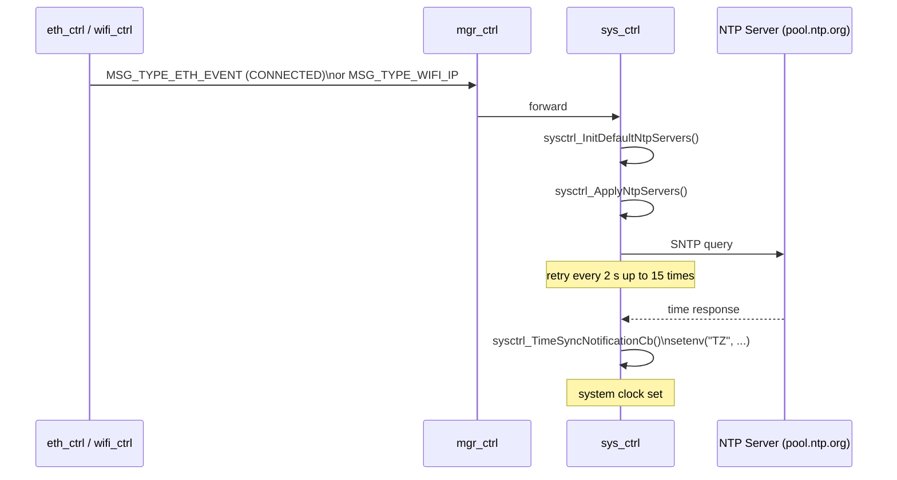
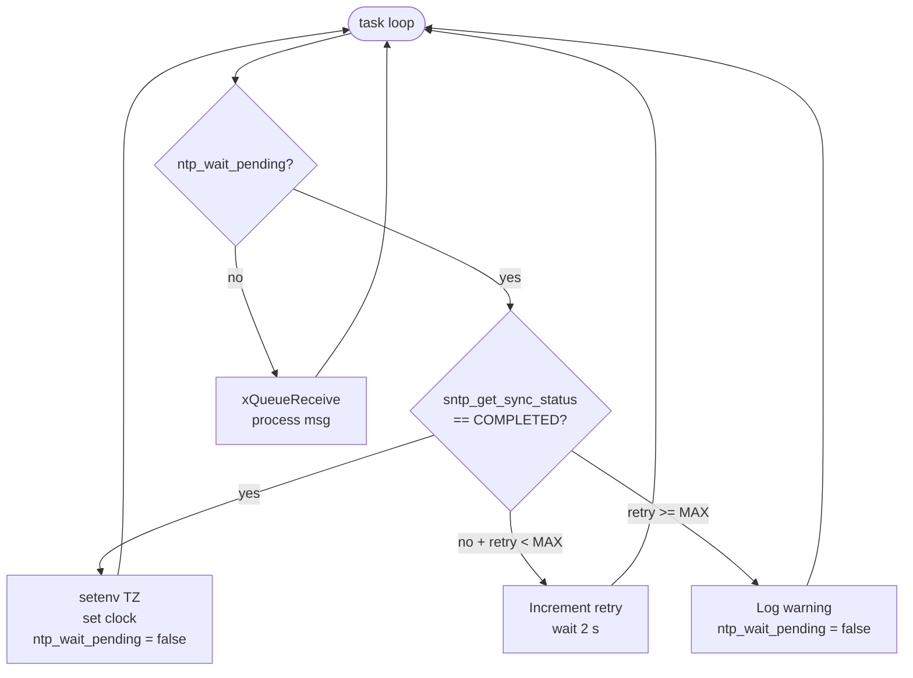

# System Controller Module (`sys_ctrl`)

Provides system-level services: NTP time synchronisation, timezone management, and system info publication over MQTT. Receives ETH/WIFI link events and uses them to trigger NTP startup.

---

## Overview

`sys_ctrl` handles everything that belongs to the "system layer" above the network and below application modules:

- **Time** — SNTP client via `esp_netif_sntp`, configurable server list, retry loop
- **Timezone** — POSIX TZ string, default CET-1CEST or selectable in menuconfig
- **System info** — publishes MAC address, uptime, firmware version to MQTT on request
- **MQTT-controlled** — NTP servers and timezone can be updated at runtime via JSON

---

## File Structure

```
modules/sys_ctrl/
├── CMakeLists.txt   — depends on esp_netif_sntp
├── Kconfig.inc      — timezone presets, NTP server default
├── sys_ctrl.c       — lifecycle, NTP retry loop, MQTT command handling
└── include/
    ├── sys_ctrl.h   — public API (SysCtrl_*)
    └── sys_lut.h    — debug name helpers
```

---

## NTP Synchronisation Flow



### NTP retry loop

The task uses `sysctrl_GetQueueWaitTicks()` (200 ms tick) to alternate between processing inbound messages and checking the SNTP sync state:



---

## MQTT Commands

Topic: `{uid}/req/sys`

### Set timezone

```json
{ "operation": "set", "fields": "timezone", "timezone": "CET-1CEST,M3.5.0,M10.5.0/3" }
```

### Set NTP server(s)

```json
{ "operation": "set", "fields": "ntp", "servers": ["pool.ntp.org", "time.google.com"] }
```

### Get system info

```json
{ "operation": "get", "fields": "all" }
```

Response published to `{uid}/rsp/sys`:

```json
{
  "operation": "rsp",
  "timezone": "CET-1CEST,M3.5.0,M10.5.0/3",
  "time": "2026-05-04T12:34:56",
  "ntp_servers": ["pool.ntp.org"]
}
```

---

## Messages Consumed

| `msg.type` | Action |
|---|---|
| `MSG_TYPE_INIT` | Lifecycle: allocate task |
| `MSG_TYPE_RUN` | Lifecycle: apply default timezone |
| `MSG_TYPE_MGR_UID` | Store UID for topic construction |
| `MSG_TYPE_ETH_EVENT` | On CONNECTED: trigger NTP start |
| `MSG_TYPE_MQTT_EVENT` | On CONNECTED: subscribe `{uid}/req/sys` |
| `MSG_TYPE_MQTT_DATA` | Parse JSON command (set timezone / NTP / get) |

---

## Task Configuration

| Parameter | Value |
|---|---|
| Task name | `sys-task` |
| Stack size | 4096 bytes |
| Priority | 12 |
| Queue depth | 8 messages |
| NTP retry interval | 2 000 ms |
| NTP retry max | 15 |

---

## Kconfig Reference

Menu path: **Component config → SYS Controller**

| Option | Default | Description |
|---|---|---|
| `SYS_CTRL_ENABLE` | `n` | Enable the module |
| `SYS_CTRL_TIMEZONE_DEFAULT` | `CET` | Default timezone selection |
| `SYS_CTRL_TIMEZONE_CUSTOM_STRING` | `""` | POSIX TZ string when "Custom" is selected |
| `SYS_CTRL_NTP_SERVER_DEFAULT` | `pool.ntp.org` | Default NTP server |
| `SYS_CTRL_LOG_LEVEL` | INFO | Per-module log verbosity |

### Timezone presets

| Option | POSIX string |
|---|---|
| `SYS_CTRL_TIMEZONE_UTC` | `UTC0` |
| `SYS_CTRL_TIMEZONE_CET` | `CET-1CEST,M3.5.0,M10.5.0/3` |
| `SYS_CTRL_TIMEZONE_EST` | `EST5EDT,M3.2.0,M11.1.0` |
| `SYS_CTRL_TIMEZONE_PST` | `PST8PDT,M3.2.0,M11.1.0` |
| `SYS_CTRL_TIMEZONE_CST` | `CST6CDT,M3.2.0/2,M11.1.0/2` |

---

## Related Documentation

- [ARCHITECTURE.md](ARCHITECTURE.md) — Manager + Registry pattern
- [MQTT_CTRL.md](MQTT_CTRL.md) — Topic conventions
- [ETH_CTRL.md](ETH_CTRL.md) — Ethernet events that trigger NTP
