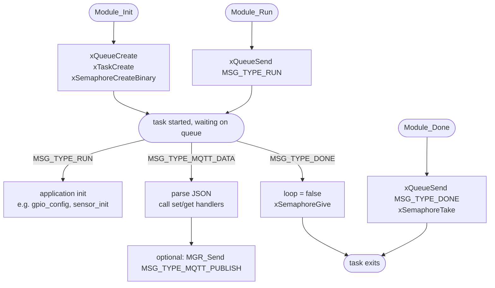

# Template Controller Module (`template_ctrl`)

Reference implementation for creating new modules. Demonstrates all required boilerplate: FreeRTOS task, queue, semaphore, lifecycle message handling, UID storage, and JSON MQTT command parsing.

---

## Purpose

`template_ctrl` is not compiled into production firmware (`CONFIG_TEMPLATE_CTRL_ENABLE` defaults to `n`). It exists solely as a copy-start point. When creating a new module:

1. Copy the entire `modules/template_ctrl/` directory
2. Rename all occurrences of `template` / `TEMPLATE` to your module name
3. Assign a new `REG_*_CTRL` bit in `include/msg.h`
4. Add an entry to `include/mgr_reg_list.h`
5. Add an `if(CONFIG_<NAME>_CTRL_ENABLE)` block to `main/CMakeLists.txt`
6. Add `orsource "<name>_ctrl/Kconfig.inc"` to `modules/Kconfig.inc`

---

## File Structure

```
modules/template_ctrl/
├── CMakeLists.txt       — minimal, no extra deps
├── Kconfig.inc          — enable flag, log level
├── template_ctrl.c      — full boilerplate implementation
└── include/
    └── template_ctrl.h  — public API (TemplateCtrl_*)
```

---

## Module Pattern (Boilerplate)

Every module in the platform follows this exact structure:



---

## JSON Command Template

The template includes a JSON parser stub that recognises `"operation": "set"` and `"operation": "get"`:

```json
{ "operation": "set", "key": "value" }
{ "operation": "get" }
```

Responses are published to `{uid}/res/template`:

```json
{ "operation": "response", "request": "get" }
```

---

## UID Handling

Every module that publishes MQTT messages stores the device UID received via `MSG_TYPE_MGR_UID`:

```c
case MSG_TYPE_MGR_UID: {
    size_t uid_len = strnlen(msg->payload.mgr.uid, sizeof(esp_uid) - 1U);
    memcpy(esp_uid, msg->payload.mgr.uid, uid_len);
    esp_uid[uid_len] = '\0';
    break;
}
```

Then uses it for topic construction:

```c
snprintf(topic, sizeof(topic), "%s/res/template", esp_uid);
```

---

## Task Configuration (defaults)

| Parameter | Value |
|---|---|
| Task name | `template-task` |
| Stack size | 4096 bytes |
| Priority | 12 |
| Queue depth | 8 messages |

---

## Kconfig Reference

Menu path: **Component config → Template Controller**

| Option | Default | Description |
|---|---|---|
| `TEMPLATE_CTRL_ENABLE` | `n` | Enable the module (off by default) |
| `TEMPLATE_CTRL_LOG_LEVEL` | INFO | Per-module log verbosity |

---

## Checklist for New Module

- [ ] Copy `template_ctrl/` → `<name>_ctrl/`
- [ ] Rename all symbols: `template` → `<name>`, `TEMPLATE` → `<NAME>`
- [ ] Add `#define REG_<NAME>_CTRL (1 << N)` in `include/msg.h`
- [ ] Add registry entry in `include/mgr_reg_list.h`
- [ ] Add `if(CONFIG_<NAME>_CTRL_ENABLE)` block in `main/CMakeLists.txt`
- [ ] Add `orsource "<name>_ctrl/Kconfig.inc"` in `modules/Kconfig.inc`
- [ ] Add any new `MSG_TYPE_<NAME>_*` values in `include/msg.h` if needed

---

## Related Documentation

- [ARCHITECTURE.md](ARCHITECTURE.md) — Manager + Registry pattern, full module lifecycle
- [CFG_CTRL.md](CFG_CTRL.md) — Another minimal module example
- [MQTT_CTRL.md](MQTT_CTRL.md) — Topic and payload conventions to follow in `set`/`get` handlers
