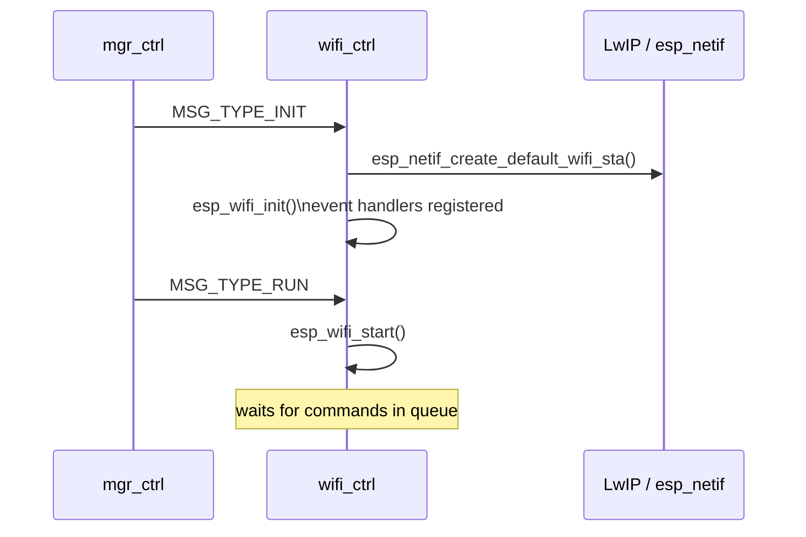
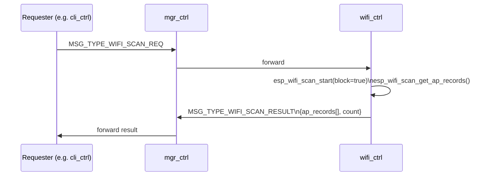
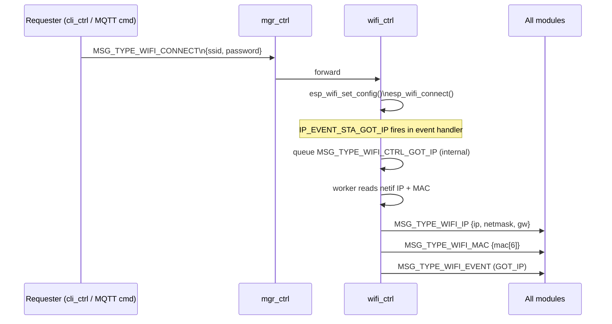

# WiFi Controller Module (`wifi_ctrl`)

Station-mode (STA) Wi-Fi controller. Supports network scanning, connection management, and IP acquisition. Forwards link and IP events to all other modules via the manager message bus.

---

## Overview

`wifi_ctrl` wraps the ESP-IDF Wi-Fi driver in the standard module pattern. It exposes three operations that can be triggered by inbound messages:

| Operation | Trigger message | Description |
|---|---|---|
| **Scan** | `MSG_TYPE_WIFI_SCAN_REQ` | Asynchronous for the requester: request is queued and handled by `wifi_ctrl`, while the worker performs an internal blocking scan via `esp_wifi_scan_start(block=true)`; result is returned via `MSG_TYPE_WIFI_SCAN_RESULT` |
| **Connect** | `MSG_TYPE_WIFI_CONNECT` | Set SSID/password and call `esp_wifi_connect()` |
| **Disconnect** | `MSG_TYPE_WIFI_DISCONNECT` | Call `esp_wifi_disconnect()` |

---

## File Structure

```
modules/wifi_ctrl/
├── CMakeLists.txt   — depends on esp_wifi, esp_netif
├── Kconfig.inc      — scan buffer size, log level
├── wifi_ctrl.c      — lifecycle + worker task + event handlers
└── include/
    └── wifi_ctrl.h  — public API (WifiCtrl_*)
```

---

## Message Flow

### Startup



### Scan



Note: the request path is asynchronous for the caller, but scan execution inside the `wifi_ctrl` worker task is blocking by design (`esp_wifi_scan_start(block=true)`).

### Connect / IP acquisition



---

## Messages Consumed

| `msg.type` | Action |
|---|---|
| `MSG_TYPE_WIFI_SCAN_REQ` | Run blocking scan, return result |
| `MSG_TYPE_WIFI_CONNECT` | Configure SSID/password and connect |
| `MSG_TYPE_WIFI_DISCONNECT` | Disconnect from AP |
| `MSG_TYPE_WIFI_CTRL_GOT_IP` | Internal: read netif data and broadcast IP/MAC |
| `MSG_TYPE_DONE` | Shutdown worker task |

## Messages Emitted

| `msg.type` | `msg.to` | Payload |
|---|---|---|
| `MSG_TYPE_WIFI_EVENT` | `REG_ALL_CTRL` | `event_id` |
| `MSG_TYPE_WIFI_IP` | `REG_ALL_CTRL` | `ip`, `netmask`, `gw` |
| `MSG_TYPE_WIFI_MAC` | `REG_ALL_CTRL` | `mac[6]` |
| `MSG_TYPE_WIFI_SCAN_RESULT` | requester | `ap_records[]`, `count` |

---

## Scan Results (`get_fn`)

The scan snapshot can be pulled by other modules without direct coupling via the bulk-read callback:

```c
MGR_GetData(REG_WIFI_CTRL, WIFI_GET_SCAN_RESULT, my_callback, ctx);
```

This triggers `wifi_ctrl`'s `get_fn`, which copies the current `s_ap_records[]` into the callback without the caller needing to include `wifi_ctrl.h`.

---

## Task Configuration

| Parameter | Value |
|---|---|
| Task name | `wifi-ctrl-task` |
| Stack size | 6144 bytes |
| Priority | 11 |
| Queue depth | 8 messages |
| Shutdown queue timeout | 60 000 ms |
| Shutdown semaphore timeout | 10 000 ms |

---

## Kconfig Reference

Menu path: **Component config → WiFi Controller**

| Option | Default | Description |
|---|---|---|
| `WIFI_CTRL_ENABLE` | `n` | Enable the module |
| `WIFI_CTRL_SCAN_MAX_AP` | `20` | Maximum AP records stored after a scan (1–40) |
| `WIFI_CTRL_LOG_LEVEL` | INFO | Per-module log verbosity |

---

## Related Documentation

- [WIFI.md](WIFI.md) — Wi-Fi provisioning and connection flow detail
- [CLI_CTRL.md](CLI_CTRL.md) — `cli_wifi` sub-commands trigger scan and connect
- [ARCHITECTURE.md](ARCHITECTURE.md) — Manager + Registry pattern
