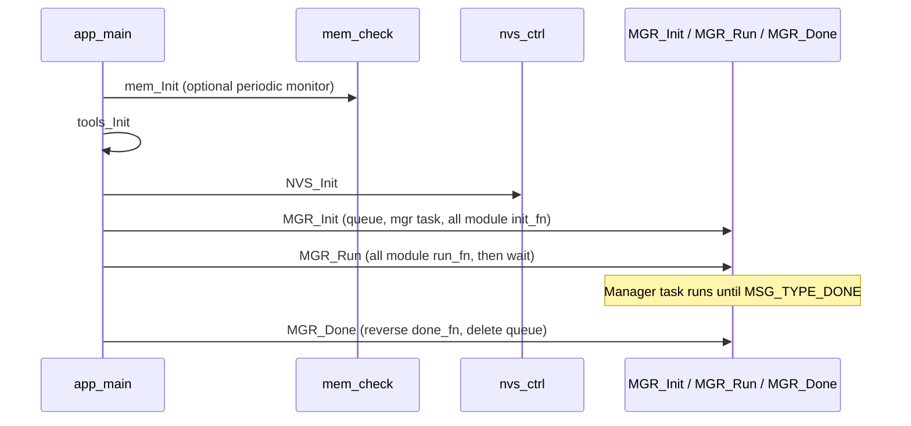
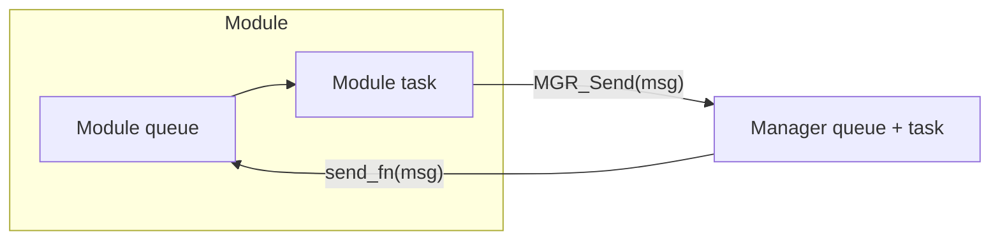
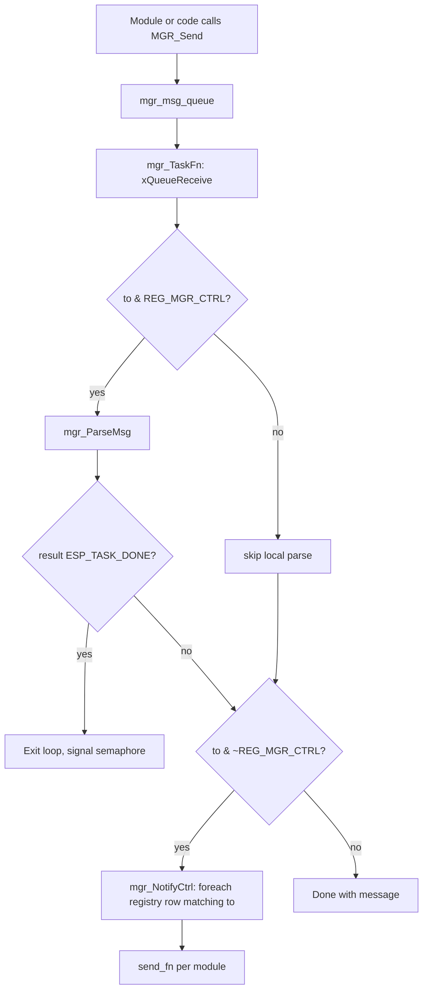
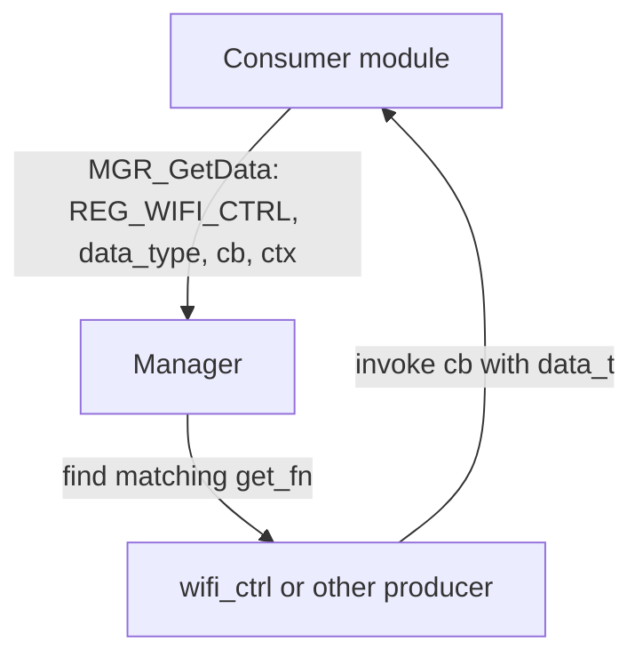

# Firmware architecture

This document describes how the ESP-IDF application is structured: startup, the central manager, optional feature modules, messaging, MQTT bridging, and bulk data reads. It complements topic-level details in [mqtt.md](mqtt.md), board notes in [build.md](build.md), and the LCD stack in [LCD.md](LCD.md).

## High-level view

The firmware targets ESP32-family boards and coordinates networking (Ethernet and/or Wi‑Fi), optional peripherals, an LVGL-based LCD UI, sensors, and an MQTT link to a broker. Logic is split into **independent controllers** (components under `modules/`) that do not call each other directly for core control flow; they exchange work through the **manager** and shared types in `include/`.

### Current checked-in ESP32 profile

The checked-in `sdkconfig.defaults` currently boots a fairly complete ESP32 profile with:

- `eth`
- `wifi`
- `relay`
- `lcd`
- `sys`
- `sensor`
- `cli`
- `mqtt`

With Ethernet connected, the runtime registration event published to MQTT advertises this module list in the same order. The default ESP32 profile also uses **4 MB** flash and the custom partition table `config/partitions-esp32.csv`.

```text
                    ┌───────────────────────────────────────┐
                    │              MQTT broker              │
                    └───────────────────┬───────────────────┘
                                        │
┌───────────┐   msg_t   ┌───────────────▼──────────────┐   msg_t   ┌────────────┐
│  Module   │ ────────► │  Manager (mgr_ctrl)          │ ◄──────── │  Module    │
│  tasks    │           │  - queue + dispatch task     │           │  tasks     │
└─────┬─────┘           │  - registry iteration        │           └─────┬──────┘
      │                 │  - MQTT topic routing        │                 │
      │                 └───────────────┬──────────────┘                 │
      │                                 │                                │
      ▼                                 ▼                                ▼
 Drivers, LVGL, Wi‑Fi / ETH stacks, NVS, JSON (cJSON), FreeRTOS
```

## Repository layout (logical)

| Area | Role |
| ---- | ---- |
| `main/` | `app_main`, NVS helper, **manager** (`mgr_ctrl.c`), memory tooling, shared utilities |
| `include/` | Shared contracts: `msg_t`, registry types (`mgr_reg_t`), `data_t` for bulk reads |
| `modules/*_ctrl/` | Feature components: own FreeRTOS task + queue, `CMakeLists.txt`, `Kconfig` |
| `drivers/` | Extra components (e.g. TSL2561), on `EXTRA_COMPONENT_DIRS` with `modules/` |

## Application startup

`app_main` initializes low-level services, then hands control to the manager. `MGR_Run` blocks until the manager task signals shutdown (semaphore), after which modules are torn down in reverse registration order.



## Manager and module registry

The manager owns:

- A **FreeRTOS queue** of fixed-size `msg_t` structures (`MGR_MSG_MAX`).
- A **dispatcher task** that dequeues messages, optionally handles them locally, then forwards to one or more modules by bitmask (`msg.to`).
- The **module table** `mgr_reg_list[]` in `include/mgr_reg_list.h`, built from `sdkconfig` so only enabled components are compiled in.

### Registration order (contract)

1. **`eth_ctrl` must be the first** entry when enabled: Ethernet identity and IP events drive UID creation, MQTT start/stop, and registration publish semantics.
2. **`mqtt_ctrl` must be the last** entry when enabled: during `mgr_Init`, the manager caches `mqtt_ctrl`’s `send_fn` as the fast path for broker operations (`mgr_send_to_mqtt_fn`).

Other modules sit between these two in a stable, menuconfig-dependent order (Wi‑Fi, GPIO, power, relay, LCD, cfg, sys, sensor, template, CLI, etc.).

### Module surface (`mgr_reg_t`)

Each registered module implements the same contract (`include/mgr_reg.h`):

| Callback | When it runs |
| -------- | ------------- |
| `init_fn` | During `MGR_Init`, in registry order |
| `run_fn` | Once after all inits succeed, same order |
| `send_fn` | When the manager (or another path) delivers a `msg_t` whose `to` mask includes the module’s `type` |
| `done_fn` | During `MGR_Done`, **reverse** order |
| `get_fn` | Optional; used with `MGR_GetData` for bulk/snapshot data without tight coupling between consumers |

## Typical module internals

Controllers follow a common pattern (see `modules/template_ctrl/`):

- Private `QueueHandle_t` for inbound work.
- A dedicated **FreeRTOS task** that blocks on the queue, parses JSON for MQTT-driven commands where applicable, and calls `MGR_Send` to publish events or request manager-side handling.
- Synchronization primitives as needed (e.g. counting semaphore for clean shutdown).



## Message model (`msg_t`)

Inter-module traffic uses `msg_t` (`include/msg.h`):

- **`type`** — discriminant (`msg_type_e`): lifecycle (`INIT`/`DONE`/`RUN`), Ethernet/Wi‑Fi/MQTT events, LCD updates, etc.
- **`from` / `to`** — bitmasks of `REG_*_CTRL` flags. The manager matches `to` against each row in `mgr_reg_list[]` and invokes matching `send_fn` implementations.
- **`payload`** — union selected by `type` (Ethernet MAC/IP, Wi‑Fi scan/connect, MQTT topic/payload, manager UID broadcast, …).

**Manager self-addressing:** If `msg.to` includes `REG_MGR_CTRL`, the manager task runs `mgr_ParseMsg` first (e.g. Ethernet disconnect stops MQTT; Ethernet IP starts MQTT; inbound MQTT data is parsed and routed by topic).

**Broadcast:** `REG_ALL_CTRL` is used for UID distribution and similar fan-out.

## Manager task message flow



## MQTT path

`mqtt_ctrl` is the only module that talks to the ESP-MQTT client for broker I/O. Other modules request publishes/subscribes by sending `msg_t` values toward `REG_MQTT_CTRL` (directly via cached `send_fn` from the manager for some housekeeping, or through the normal dispatch path).

### Inbound (broker → device)

1. `mqtt_ctrl` receives payload on a subscribed topic.
2. It posts to the manager (e.g. `MSG_TYPE_MQTT_DATA` with topic + body).
3. `mgr_ParseMqttData` distinguishes `REGISTER/ESP/...` handling from per-device topics of the form `{uid}/req/{module}` and forwards the **original** `msg_t` to the target module’s `send_fn` by matching the module name embedded in the topic.


### Outbound and lifecycle hooks

Examples handled inside `mgr_ParseMsg`:

- **Ethernet got IP** → start MQTT client.
- **Ethernet disconnected** → stop MQTT client.
- **MQTT connected** → publish module list JSON, subscribe `REGISTER/ESP/#` and `{uid}/req/{name}` for each registered name.

Exact topic strings and JSON shapes are documented in [mqtt.md](mqtt.md).

## Bulk reads (`get_fn` / `MGR_GetData`)

Some data (e.g. a Wi‑Fi scan list) should be produced once and consumed by multiple modules (LCD, MQTT) without those modules including each other’s headers. The registry optional **`get_fn`** plus **`MGR_GetData`** (`main/mgr_ctrl.c`) resolves a **single** module bitmask to a producer and invokes a caller-supplied callback with a `data_t` view (`include/data.h`: `type`, `count`, `size`, `data` pointer). The producer defines the binary layout per `data_type_e`; consumers interpret it per module documentation.



## Build-time composition

- **`sdkconfig`** / **`sdkconfig.defaults`** set `CONFIG_*_CTRL_ENABLE` for each module.
- **`main/CMakeLists.txt`** appends include paths and `PRIV_REQUIRES` per enabled module. Under `CMAKE_BUILD_EARLY_EXPANSION`, **all** optional components are still listed so the dependency graph is stable before `sdkconfig` exists.
- Root **`CMakeLists.txt`** sets `EXTRA_COMPONENT_DIRS` to `drivers` and `modules`.

New modules: add the component, Kconfig symbol, `main/CMakeLists.txt` wiring, and a conditional block in `include/mgr_reg_list.h` (see [CLAUDE.md](../CLAUDE.md) in the repo root).

## Related reading

| Document | Content |
| -------- | ------- |
| [mqtt.md](mqtt.md) | Topics, JSON operations |
| [LCD.md](LCD.md) | Display, touch, LVGL notes |
| [build.md](build.md) | Board flash/serial |
| [memory.md](memory.md) | Heap profiling workflow |

Key source anchors: `main/mgr_ctrl.c` (dispatch, `MGR_GetData`), `include/mgr_reg_list.h` (registry), `include/msg.h` (`msg_t`), `include/mgr_reg.h` (`mgr_reg_t`).
